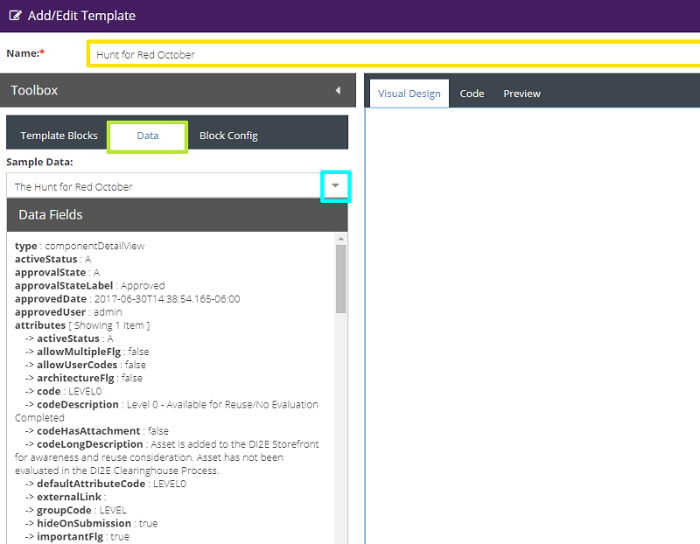
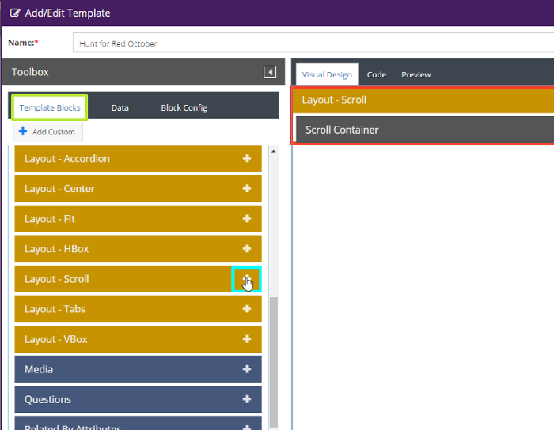
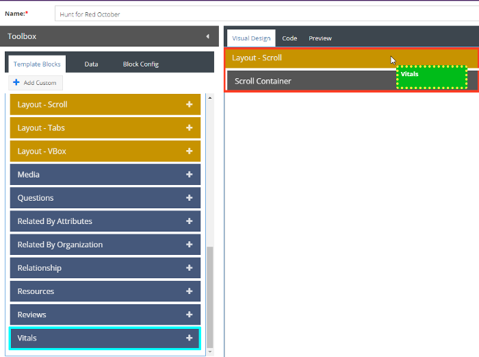
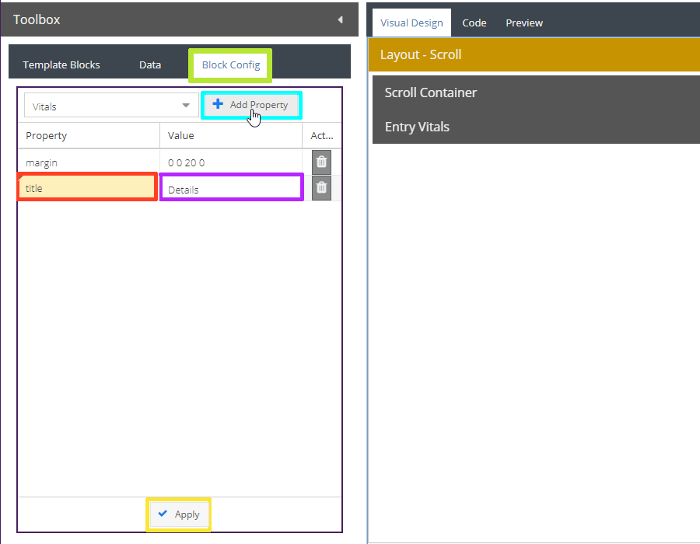
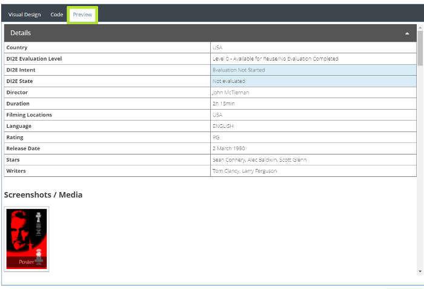
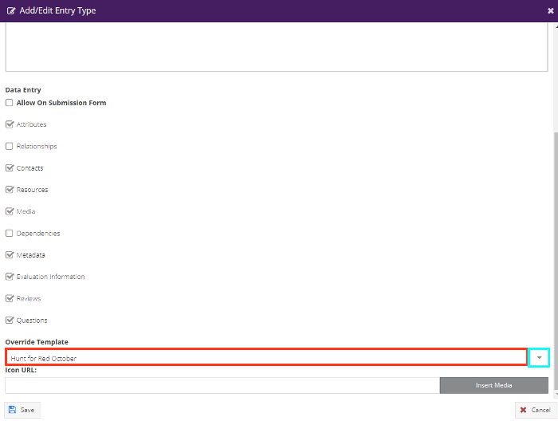

<span style="font-size: 24px;">User Guide</span>

Version 2.4
                                                     

# 1. Overview
------

This site is based on the Open Storefront application.  Open Storefront is a software cataloging system that
is used to catalog and organize any item from software to parts. 
The software provides details on the following:

-   Ownership
-   Where/How to access the entry
-   Contact information
-   Media and rich resources
-   Metadata/Attributes
-   Conformance
-   Links to documentation, source code, and other artifacts
-   Details Evaluation information

**Open Storefront is developed by Space Dynamics Laboratory is
licensed under GPL V3.**

Originally developed for DI2E (Defense Intelligence Information Enterprise)


## 1.1 Release Notes for v2.4
------

Version 2.4 incorporates:

* New Landing Page Design - Search Tools, Quick Launch, Browse by Category
* Search tools include tag cloud, organization, relationships, etc.
* Quick Launch includes dashboard, user submissions, saved searches, etc.
* Ability to print evaluations
* Side by side comparison of evaluations
* Entry detail reports will have evaluation results


### 1.1.1 Administrator Release Notes, v2.4 @ADMIN-SYSTEM-MANAGEMENT
-----

*What's new in v2.4*

* Support for customizing the landing page
* Support for metadata has been merged with attributes

For more information see <a href="https://github.com/di2e/openstorefront/releases/tag/v2.4" target="_blank">v2.4</a>, or to see information on all releases, please see the <a href="https://github.com/di2e/openstorefront/releases" target="_blank">releases page</a> in GitHub.


## 1.2 Known Issues, v2.3 @ADMIN-SYSTEM-MANAGEMENT 
 
 * 
 


# 2. User Features
------

The features that are available to users to be able to access the information in a variety of ways.

## 2.1  Searching
------

Application Search provides a way to find entry lists and articles
matching search criteria. Several types of searches are supported. The
types of searches that can be performed are:

 1.  Searching the Help file
 2.  Searching across multiple fields (entry name and description,
    tags, attribute types, codes, and descriptions)
 3.  Wildcard searching (\* and ?)
 4.  Exact phrase searching
 5.  Case insensitivity
 6.  Filtered Searches
 7.  Tags
 8.  Comparing
 9.  Customizing the display

**Note:** The type ahead on the search field only looks at the title to see if it contains the text.  
The user can then select the suggestion by clicking on it or continue with a full text search.

### 2.1.1 Searching the Help file
-------

A simple (exact text) search is provided in the help file by typing in the Search box in the 
upper-left of the help file, above the tree structure.  

### 2.1.2 Search Field Differentiation or Specificity
-------

Currently, there is no differentiation among entry Name, entry
Description, Tags, or Attributes as to the preference, specificity, or
coverage of the search. A search term or phrase is searched via a single
search box, and applied across all fields equally. For a more specific search
please see the Advanced Search under Search Tools in the help file.

### 2.1.3 Fuzzy Matching and Wildcards
------

Fuzzy matching is defined as the ability to perform inexact matches on
terms in the search index. For example, this could be used to find all
variations of prefixed or suffixed words and multiple spellings of a
word.

Fuzzy matching is done with the * and the ? characters acting as
wildcards. It is also known as wildcard searching. The * character
represents a string of letters, whereas the ? acts as a placeholder for
only a single character. The process works as shown in the queries
below:

Query: ```offi*``` Matches office, officer, official, and so on

Query: ```off*r``` Matches offer, officer, officiator, and so on

Query: ```off?r``` Matches offer, but not officer

### 2.1.4 Phrase Searches and Exact Searches
------

Exact searches must be enclosed by double quotes.

Search example: ```"create a common framework"```
Search example: ```"Air Force"``` or ```"Company Name Inc."```

Wildcards are only meant to work on individual search terms, not on
phrase searches/exact searches, as demonstrated by this example:

Works: ```eng?neering``` _(wildcard properly used)_
Does not work: ```"eng?neering b?ckground"``` _(quotes are treated as a literal string not a wildcard)_

In the second example, the search would only return results that had the
? character exactly in their respective places instead of
accepting any character in those locations as the user intended.

### 2.1.5 Case Insensitivity
------

Searching is case **insensitive** and allows mixing of case. In the
examples below, the exact same results would be returned regardless of
the capitalization.

Search examples: 
```create a common framework```, ```Create a Common Framework```, ```cReatE A CoMmoN FraMewoRk```

### 2.1.6 Filtered Searches
------

From the search results screen the left-most panel is the Filters panel.  
Here, results can be narrowed by filtering on various aspects such as:
 
 * **Name:**  The name of the entry
 
 * **Tag:**  Type the name of a tag or select from the drop-down.  Tags can be combined and 
          added to the filter or removed.
 
 * **Topic:**  DI2E Component, Article, etc.
 
 * **User Rating:**  This will show all entries with the average star rating selected 
                 (or better, i.e. or a **higher** average star rating)
 
 * **Vitals:**  This gives a fine-tuned and very detailed approach to filtering by many different 
            vitals such as DI2E Intent, State, and Alignment, for example.
 
 


### 2.1.7 Tags  
------

Users can "Tag" listings so that they can be used to later find and
refine search results. User-created tags are visible to all users.
However, only the owner of the tag or an admin user may remove a tag.
Tags are used in the search field shown at the top of the screen and 
on the home page.

**How to create a tag:**

 1.  From the search results screen, click on the entry title.  The details of the 
	 entry will be displayed.
 2.  Click on the "Tag" icon to open the tag panel.
 3.  Enter a new tag in the text field OR choose an existing tag by clicking on 
	 the drop down arrow.  Click "Add" to apply the tag to the entry.

**How to remove a tag you created:**

 1.  From the search results screen, click on the entry title.  The details of the 
	 entry will be displayed.
 2.  Click on the "Tag" icon to open the tag panel.  Tags will be displayed
	 below the "Add Tag" text field.
 3.  Locate the tag and click on the drop down arrow and select "Delete".

### 2.1.8 Comparing
---------

The comparison feature allows for side-by-side viewing of multiple
listings. For example, there may be several entries that provide the
same kind of features (e.g. Cesium and Google maps). You can use the
comparison feature to view their details together to find the entry
better suited your project's needs.

**How to compare entries:**

 1.  From the Search Results screen check the "Add to Compare" box on 2 or more 
	 entries.
 2.  Click on the **Compare** button at the top of the Search Results window.  A
	 side-by-side comparison will appear in a new window.
 3.  If more than two entries were selected, you can select which entries to compare
	 by using the drop-down list at the top to select the various entries.
 4.  To remove all selected entries,  click on the drop-down arrow next to the
	 **Compare** button and select "Clear All Selected Entries".

### 2.1.9 Customizing the Search Display
---------

On the search results page, filtering can be done by Name, Tag, Topic, User Rating, or Vitals.
To search by Topic you can use the drop-down menu or click on the hyperlink at the top
with the number of results, for example:
**[131]()** DI2E Components, **[21]()** Articles where the numbers are hyperlinks
that filter the results.

The search results display can also be customized by clicking on the gear icon
and down arrow at the top-right of the search results.  Check or uncheck the 
items to be displayed or hidden such as:

* Organization

* Badges

* Description

* Last Update

* Vitals

* Tags

* Average User Rating

* Approved Date

* Index Relevance

To reset all filters, click on the "Reset Filters" button at the bottom of the
Filters column.

Finally, the columns can be collapsed or expanded by clicking on the left and right
arrows in the column headers by Filters, Search Results, and Details. 


## 2.2 Search Tools
------

To the right of the search icon and search field is an icon for Search Tools.  Click
on the icon to display the Search Tools window.  Five tabs are displayed:

1.  Topic

2.  Category

3.  Tag

4. Architecture

5.  Advanced

6.  Saved Searches

### 2.2.1 Topic Search Tool
------

The topic tab in the Search Tools window allows searching by Articles, 
DI2E Components, or other topic search types.  

After clicking on the topic on the left, the results are shown on the right.  
Click on the column name to sort A-Z or Z-A.  Click the link button to link to 
the individual application entry.  Results of all of the topics can also be
 shown in a new window by clicking on the "Show Results" diagonal arrow button.


### 2.2.2 Category Search Tool
------

The Category tab in the Search Tools window displays many categories that
are expandable by clicking on the down arrow icon.  Click on the lowest 
subcategory to display search results.  Clicking on the column name will sort
the table A-Z or Z-A.  Clicking on the link button opens the individual entry,
 or all results can be displayed in a new window by clicking
the "Show Results" diagonal arrow button.


### 2.2.3 Tag Search Tool 
------

This window displays a list of all tags on the left.  Clicking on a tag 
shows all entries associated with that tag.  To display details of a single entry,
click on the link to the right of the description.  To view entry results
associated with a tag in a new page, click on the "Show Results" diagonal arrow. 


### 2.2.4 Architecture Search Tool
------

The Architecture tab window displays a hierarchy of results per SvcV-4 
taxonomy.  Expand All and Collapse All buttons are provided.  Clicking 
on the **+** button expands an individual folder and **-** collapses the folder.  
Search results are displayed with sortable columns and links to individual 
results or the entire search results can be opened in a new page.

### 2.2.5 Advanced Search Tool 
------

The Advanced Search tab provides a powerful tool to query the data in the application.
This allows the user to refine a search based on:

**Search Type:**  Search by Entry, Attribute, Tags, User Reviews, Questions, and more.

**Field:** The search field associated with the search type chosen above

**Value:**  alpha and/or numerical value to search for

**String/Number Operation:** Contains, Equals, <, >, and so forth depending on the value

**Merge Condition:** OR, AND, NOT to get a search results in conjunction with the other advanced search parameters

After you have specified the search conditions, click on the **Add** button to add them
 to the Search Criteria field.  To preview results based on the provided search criteria, click
on the **Preview Results** button. The advanced search can be saved by clicking on
the **Save** button. To execute a search based on search criteria click on the **Search**
button.

Once a refined search is added to search criteria section it can be edited or
deleted by clicking on the icons on the far right of a refined search entry.


### 2.2.6 Saved Searches
------

You can save complex advanced searches for later retrieval and querying.  From the Advanced tab, 
click the Save button and add a name for the saved search.  

Once it is saved the advanced search is available from the Saved Searches tab. Select a saved
search and click the "Search" button to see the results.  To manage searches, click the "Manage Searches" button
which will direct you to User Tools -> Tools -> Searches where editing can be performed.
To edit a saved search, click on the name of the search and then click on the **Edit** button at the top.


## 2.3 User Tools
------------

The user tools contain a variety of useful features including:

 1.  User Profile
 2.  Submissions
 3.  User Tools (Questions, Relationships, Reports, Reviews, Searches, Watches)

----

The User Tools landing or home page is the **Dashboard**. This is accessed by
clicking on the username in the upper-right corner followed by User Tools in the
drop-down menu.

The first time the dashboard is accessed widgets will need to be added to view.
This is done by clicking the **Add Widget** button towards the top-left of the dashboard
section.

The following widgets can be added to the dashboard by clicking on them from the 
Add Widget window and then clicking Add Selected Widgets:

 * Notifications
 * Questions
 * Reports
 * Saved Search
 * Submission Status
 * Watches

Once the desired widgets are added they can be refreshed, moved to next and previous 
display order, maximized, or closed.  In addition, certain settings such as the title
and title bar color can be set.  This is done by clicking on the buttons in the 
right of the title bar of each individual widget once added to the dashboard.

NOTE:  Administrators may have additional widgets available to them.  
 

## 2.3.1 User Profile
--------------------

All user information can be set on the main page of **User Tools**. 
Initially the user profile is populated with information from the user's 
external security account.

**To edit your profile:**

1.  Select **User Tools** from the user menu.
2.  Click on **Profile**
3.  Update the form.
4.  Click **Save**.

The application sends out notification emails about any changes that
have occurred since the last time a recent change notification email was
sent out. This allows the user to be aware of all the new and modified
listings on the application.

**To receive the notification:**

1.  Select **User Tools** from the drop-down menu in the upper-right with the username.
2.  Click on **Profile**.
3.  Ensure that a valid email address is present in the user profile.
4.  Check the checkbox, **Receive periodic email about recent changes**.
5.  Click **Save**.

### 2.3.2 Submissions @USER-SUBMISSIONS
-----------

This page displays all of the submissions you, the current logged in user, have
made.  In the User Submissions table, the columns can be sorted by clicking on 
the column header.  // Describe process flow


#### 2.3.2.1 How to Create a Submission/Entry @USER-SUBMISSIONS
-----------

The first tab of a new submission should be pre-filled with your logged in user information.  
Make any necessary corrections and click on the Next button at the bottom.


#### 2.3.2.2 How to Create a Change Request/Edit Entry @USER-SUBMISSIONS
-----------

Step 1) Click on the entry you wish to edit  
Step 2) Click on the "Request Change" button in the submissions toolbar  
Step 3) A change request form will appear that requires 4 steps:  

	1. Verify or update all user information and click the "Next" button
	2. Fill in or edit the required fields and click "Next"
	3. Add/Delete any details (e.g. attributes, contacts, media, etc.) and click "Next"
	4. Review the entry and click "Submit For Review".  This will take you back to the submissions page

Under the "Pending Change" column you will see the status of the entry's change request.  The status is "Pending" 
until the admin user approves the changes. 

* Note: If you need to update the submitter contact and you are the submitter then update your profile on step 1 
rather than updating the contact information on step3.  That way the contact information will not be overridden by your
user profile.


#### 2.3.2.3 How to Delete an Entry
-----------

1.  Click on the entry you wish to remove
2.  Click on "Request Removal" in the submission toolbar
3.	Fill out the Request Removal form by providing a reason for removal then click "Send" 
	at the bottom of the form
4.  Once request for removal is approved, the entry will no longer appear in user's list of submissions.


#### 2.3.2.4 Other Submission Features @USER-SUBMISSIONS
-----------

A user can copy or preview an entry by selecting an entry and clicking on the "Options" 
drop-down arrow in the submissions toolbar.  Users can also toggle notify by selecting an entry
 and clicking on the "Options" drop-down arrow in the toolbar.

### 2.3.3 Tools
-----------

The Tools drop-down contains five options:

1.  Questions
2.  Relationships
3.  Reports
4.  Reviews
5.  Searches
6.  Watches

#### 2.3.3.1 Questions & Answers
--------

Under User Tools->Tools->Questions there are two tabs: one for questions
submitted under the current login and another tab for answers submitted.

By default the **Questions** tab is selected and it is here that a user can select
his/her entry and edit a user-submitted question. To edit a question follow the steps below:

	1. Click on the entry you wish to change
	2. Click the **Edit** button in the toolbar
	3. Make any changes to the question and click on **Post** at the bottom.

To view entries with user-submitted answers, click on the **Answers** tab.  It is here that
a user can select an entry and edit his/her answer to an entry's question.  To edit a 
question follow the steps below:

	1. Click on the entry you wish to change
	2. Click the **Edit** button in the toolbar
	3. Make any changes to the question and click on **Post** at the bottom.

A user can remove an answer or question by clicking on the entry and then clicking
 on the **Delete** button on the right-hand side of the toolbar.

#### 2.3.3.2 Relationships @RELATION-VIEW-TOOL
--------

This screen shows a graphical representation among entries based on organization, attributes,
 tags, and direct entry relationships.
 
A particular view can be saved by pressing the **Download Image** button.  The **Find** drop-down menu
allows the user to search for an entry in the current view on the page.


#### 2.3.3.3 Reports @REPORTS
--------

This section displays reports that have run as well as scheduled reports that will run in the future.

Reports can be viewed, downloaded, or added.  Scheduled reports can be edited.  
Selections can be made to run a report one time only or at regular intervals.  
Some reports have the option of HTML or Comma-Separated Values as the report format.  
If selecting Previous days, the selected number of prior days will be included in the report output.  

Types of reports available include:
  - Entry
  - Entry Detail
  - Entries by Organization
  - Entries by Category

**How to generate a report:**

1. Click on **New Report** in the reports toolbar
2. Select the report type from the drop-down menu 
3. Select the report format and how often to run the report
4. User is able to restrict report to only selected entries under the **Restrict By Entry** field
5. Click the **Generate** button

Reports can be removed by selecting the report and clicking on **Delete** in the toolbar.  To view
a report, click on the report and then click **View** in the toolbar.

**Scheduled Reports**
Clicking this button opens a window that shows recurring reports, their details and frequency that 
the report will run, as well as the last run date and time. You can add, activate, or inactivate a 
scheduled report, edit, or delete it.


#### 2.3.3.3 Admin Reports @REPORTS-ALL
--------

This section displays reports that have run as well as scheduled reports that will run in the future.

Reports can be viewed, downloaded, or added.  Scheduled reports can be edited.  
Selections can be made to run a report one time only or at regular intervals.  
Some reports have the option of HTML or Comma-Separated Values as the report format.  
If selecting Previous days, the selected number of prior days will be included in the report output.  

Types of reports available include:
  
  - Entry
  - Entry Detail
  - Entries by Organization
  - Entries by Category

Additional reports available to administrators only include:

  - **User**
  - **User Organization**
  - **Usage**
  - **Submissions**
  - **Link Validation**


**Scheduled Reports**
Clicking this button opens a window that shows recurring reports, their details and frequency that 
the report will run, as well as the last run date and time. You can add, activate, or inactivate a 
scheduled report, edit, or delete it.

  
#### 2.3.3.4 Reviews
------------

Entry reviews can be found under the **Tools** drop-down menu. Users can edit and delete their entry reviews.

**To edit a review:**
 - Select a review and click **Edit**.  Update the fields as desired and click **Post Review** (or Cancel).

**To remove a review:**
 - Select a review and click **Delete** in the toolbar.  Confirm the deletion by clicking **Yes** in the confirmation box.

 **NOTE:** A review may also be removed from the search results detail screen
by clicking on the delete icon next to the title of the review. You can only remove reviews you post.

**To create a review, see Section 2.4 - Entry Details and Features**


#### 2.3.3.5 Searches
------------

This tab displays the list of saved searches from the Advanced Search area.
It also allows the user to Add, Edit, and Delete advanced searches.

**For more information, see the Advanced Search Section under Search Tools.**


#### 2.3.3.6 Watches
------------

The user can create watches that can send notifications to the user. The
messages that the watches generate are viewable from the User Message
Tool. The User Message Tool allows for queued messages to be processed
after a delayed time period. The queue delay allows for messages to be
pooled by type thereby reducing the amount of emails rapid changes can
create. The User Message can also be used to view previously sent
messages in cases of troubleshooting whether the system sent a
notification or not. The tools also allow for manually processing the
queue immediately, but in most cases this is not needed or desired as
the automatic process will take handling the message queue.

A watch is set on an entry to allow for a user to be notified of
changes to an entry. There are two ways notifications occur in the
application, and there is no limit to the amount of watches a user may
place.

1.  The watched entry's changes are visually shown to the user
    anytime changes have been made since they last viewed the entry.
    This is seen in the watches tab and when viewing the details of
    an entry.

2.  The user may opt to have an email sent anytime there is a change. To
    opt in, see the steps listed below. The email will list the section
    of the entry information as to what has changed. A user then can
    login to view the exact changes.

**To activate email:**

1.  Make sure your user profile contains a valid email. View your
    profile from the Profile button at the top of the screen in User Tools.

2.  Select a watch from User Tools, Tools, Watches.  Click the Toggle 
    Email Notification button to turn on or turn off the email notifications.

**See the Section 2.4 for information on how to add or remove an entry to watch list.**


## 2.4  Entry Details and Features
--------

Click on an entry to view its details.  From the **Details** page, a user can write a review, submit
a question or answer, add a tag, watch an entry, submit a correction, and request ownership.

### 2.4.1  Create/Delete a Review
--------

How to submit a review of an entry:

1.  From the **Details** page, click on the **Reviews** tab.  
2.  Click on the **Write a Review** button
3.  Complete the required fields on the form and click **Post Review** at the bottom.

To edit a review, click on the **Edit** button.  Make any changes to the review and click **Post Review**.
To remove a review, click on the **Delete** button.  A confirmation box will ask the user to confirm 
the deletion of the review.

### 2.4.2  Submit/Delete a Question/Answer
--------

How to submit a question about an entry:

1.  From the **Details** page, click on the **Questions & Answers** tab.
2.  Click on the **Ask a Question** button
3.  Type your question into the text area and click on the **Post** button

To edit a question, click on the **Edit** button.  Make any changes to the question and click **Post**.
To remove a question, click on the **Delete** button.

How to submit an answer to an entry question:

1.  From the **Details** page, click on the **Questions & Answers** tab.
2.  Locate the question and click on the **Answer** button.
3.  Type your answer into the text area and click on the **Post** button.

To edit an answer, click on the **Edit** button.  Make any changes to the answer and click **Post**.
To remove an answer, click on the **Delete** button.

### 2.4.3  Add/Delete a Tag to an Entry
--------

From the **Details** page, click the **Tags** button in the upper-right corner of the entry.
An **Add Tag** box will appear at the top of the **Details** page where you can either type in your own tag or
select an existing tag from the drop-down menu.  Click **Add** to attach tag to entry.

To remove a tag, click on the tag's drop-down arrow and select **Delete**.

### 2.4.4  Add/Delete an Entry to Watch List
--------

Click on an entry to view it's **Details** page.  From the **Details** page, click on the **Watch** icon
in the right upper corner (eye icon).  To remove an entry from your watch list, click on the **Watch** icon.

### 2.4.5  Submit Correction and/or Request Ownership
--------

On a particular entry you can submit a correction for administrative review and/or
request ownership of an entry.  To do this:

 1.  From the search results note the icons at the top (Tag, Watches, Print, etc.)
 2.  If a menu button (horizontal bars) icon appears, it means you have authorization
     to request a correction or ownership change.  Click the icon and the appropriate
	 sub-menu.
	 
**Submit Correction/ Request Ownership forms:**

* Fill out the form including the section needing correction and the changes requested or
 the reason you are requesting the change of ownership
 
* Ensure your contact information is current in the section below or update your profile.

* Click Send.

* Your correction or ownership request will be reviewed by an administrator.


### 2.4.6  Printing Entry Details
--------

Many areas of the website have a **Go To Print View** icon to facilitate printing
of the displayed information.  From the entry **Details** page, click on the **Print** button
in the top right corner.  A window will pop-up where you can either customize the template or
use the default.

## 2.5 Evaluation Tools @EVALUATIONS 

Evaluations are accessed by going to your user name in the upper-right of the browser window.  In the drop-down select Evaluation Tools.  A dashboard is displayed.

### 2.5.1 Dashboard @EVALUATIONS 

The dashboard can be customized with various widgets to be displayed.  Individual widgets can be configured to show pertinent information such as assigned user, status, and if the evaluation has been published.

### 2.5.2 Evaluations @EVALUATIONS 

The evaluations section shows a table of evaluations assigned to you.  Filters can be set for the assigned user, assigned group, and workflow status.

Selecting an evaluation allows you to Assign it to another user or to Edit the evaluation.

When Editing the evaluation the status can be changed and the various forms, questions, and other information is entered.  A change history is kept and comments can be added.

The preview button will show what the evaluation will look like when published.  Private information will not be shown.


# 3. Admin Tools @ADMIN-SYSTEM-MANAGEMENT
--------

Admin tools allow for the management of all data in the system.
 
(Sections marked with * require admin account access.)


## 3.1 Dashboard @ADMIN-SYSTEM-MANAGEMENT
--------

The dashboard is the homepage of the Admin Tools.  This is accessed by
clicking on the username in the right upper corner and then clicking **Admin Tools** 
in the drop-down menu.

The first time the dashboard is accessed, widgets will need to be added to view.
This is done by clicking the **+Add Widget** button towards the top of the dashboard
section.

The following administrative widgets can be added to the dashboard by clicking on them from the 
Add Widget window and then clicking Add Selected Widgets:

 * Entry Stats
 * Notifications
 * Outstanding Feedback
 * Pending Approval Requests
 * Questions
 * Recent User Data
 * Reports
 * Saved Search
 * Submission Status
 * System Status
 * User Stats
 * Watches

Once the desired widgets are added, they can be refreshed, moved to next and previous 
display order, maximized, or closed.  In addition, certain settings such as the title
and title bar color can be set.  This is done by clicking on the buttons in the 
right upper corner of the title bar of each individual widget.

## 3.2 Data Management @ADMIN-ENTRY-MANAGEMENT
--------

The Data Management menu is used to navigate to different tools for managing the data
for Storefront.


### 3.2.1 Attributes @ADMIN-ATTRIBUTE-MANAGEMENT
-------

Attributes are used to group and filter catalog items such as entries and articles. 
To access the attributes page, go to Admin Tools -> Data Management -> Attributes.

Functional Areas of Managing Attributes includes:

  1. Adding New Attribute Type
  2. Entry Assignment
  3. Editing Attributes
  4. Managing Codes
  5. Setting Flags, Toggling Status, and Deleting
  6. Importing and Exporting

  
#### 3.2.1.1 Add New Attribute Type @ADMIN-ATTRIBUTE-MANAGEMENT
------

Attribute Types represent a related group of specific categories or
represent a single attribute of a listing (E.g. "Funded" would be a type
with the corresponding value "Yes" or "No"). A type may have many codes.  

Deleting a type will delete the associated codes and entry
attributes. Inactivating a type will inactivate associated data such as
entry attributes.

**NOTE**: Avoid "/" and special characters in type codes. For example,
use: \[A-Z\]\[0-9\].

**To add or edit a type:**

From the Attribute Tool, click on the **Add New Type** button or the
    **Edit Attribute** button.

**FIELDS include:** 

 1. Label:  The name of the Attribute
 2. Type Code:  The unique code, should be ALL-CAPS and should not contain spaces or "/". 
 3. Detailed Description:  The description of the attribute.  It can contain formatted (rich) text.
 4. Associated Entry Types:  Allow this attribute on all types or only certain types (Articles, Entries, etc.)
 5. Flags:  Set the flags shown on the main page for Required, Visible, Important, Architecture, Allow Multiple,
     Allow User-Created Codes, or Hide on Submission.
 6. Code value type: set the allowed values for codes and labels
 

#### 3.2.1.2 Entry Assignment @ADMIN-ENTRY-MANAGEMENT
------

This allows for quick drag-and-drop assignment of an entry with an attribute and its associated code.  From the 
Manage Assignments window (click on Entry Assignment in Attributes) select an Attribute from the drop-down and 
an associated attribute code from the next drop-down.

Now a list of all Entries that are NOT assigned to that attribute and code are shown on the left. To associate this 
attribute and code with an entry, simply drag it to the right to the Assigned Entries column.  To remove it, drag it
back to the left (Unassigned Entries) column.


#### 3.2.1.3 Editing Attributes @ADMIN-ATTRIBUTE-MANAGEMENT
------

Refer to 3.2.1.1 on Adding a New Attribute type for a list of fields available.  When finished editing click Save.


#### 3.2.1.4 Managing Codes @ADMIN-ATTRIBUTE-MANAGEMENT
------

An attribute code is a specific category value that can be applied to a
entry. For example: Entry listing may contain and attribute for
"Funded" as "Yes".

**To add a new code:**

1.  Click on the **Manage Codes** button.
2.  Click **Add New Code**.
3.  Fill out the form.
4.  Click the **Save** button at the bottom..

**To edit an attribute code:**

1.  Click on the **Manage Codes** button.
2.  Click on the attribute code you want to edit
3.  Make changes to the form and click the **Save** button at the bottom.

**To deactivate an attribute code:**

1.  Click on the **Manage Codes** button.
2.  Click on the code you want to deactivate.
3.  Click on the **Deactivate** button.

**To activate an attribute code:**

1.  Click on the **Manage Codes** button.
2.  Click on the drop-down arrow under **Active Status** and select "Inactive".
3.  Click on the code from the list of inactive and click **Activate**.

**Attachments:**

1.  An attachment can be added, downloaded or deleted from a code.
2.  The attachment will show up in the search results entry vitals section, if the attribute appears there.

**Field Descriptions:**

-  **Label**               - Human readable value of the code (May only allow numbers if depending on the Attribute type)
-  **Code**                - System reference key  (May only allow numbers if depending on the Attribute type)
-  **Description**         - This is a detail description of the meaning of the value. It is used in pop-up to help users interpolate the data.
-  **Group Code**          - Using to create sub groups in the code. Typically used only in special cases.
-  **Sort Order**          - Use to force a specific sort order. (Default is sort by Label)
-  **Architecture Code**   - Used for special hierarchical sorting. Only applies to Architecture attribute types
-  **Badge URL**           - Set to add a graphical badge for a code
-  **Highlight Class**     - Used to add color emphasis to a code


#### 3.2.1.5 Setting Flags, Toggling Status, and Deleting @ADMIN-ATTRIBUTE-MANAGEMENT
------

From the attributes page the Action button has three sub-menus:
 1. Set Flags
 2. Toggle Status
 3. Delete
 
 To **Set Flags** select one or more attributes then click on Action -> Set Flags.  From here you can 'bulk' change
 the Visible, Important, Architecture, Allow Multiples, Allow User Codes, and Hide On Submission flags.  Options include
 to set the flag to True, False, or No Change.  Click Update when finished.
 
 * **NOTE:** The _Required_ flag is not shown in the Set Flags box as it is mutually exclusive with Allow Multiples.  If
          the Allow Multiples section is not available for changing, it is because one or more previously selected
          attributes are required.  Delete the required flag(s) on those attribute(s) and then the Allow Multiple flag
          will be available for changing.

 To **Toggle Status** select one or more attributes then Action -> Toggle Status.  The status of each selected 
    attribute will be reversed, i.e. all of the Active ones become Inactive and all of the selected Inactive attributes
    now become Active.  The status is shown in the table by the Status column, at the far right with "A" or "I".
    
 To **Delete** select one or more attributes and Action --> Delete.  It is possible to delete multiple attributes at once.
 

#### 3.2.1.6 Importing and Exporting Attributes @ADMIN-DATA-IMPORT-EXPORT
------

Clicking the **Import** button from Manage Attributes will show buttons to brows and upload files.

1.  Browse to the desired file to be uploaded (imported).
2.  Make sure the Attributes file is in the correct format and it contains the correct columns. 
    (See warning on upload for the expected fields)
3.  Select the proper file.
4.  Click **Upload**.

 **WARNING:** UID in the file should match what is stored in application.
    The application supports both 1 and 0001 matching to 1.
    
From the Manage Attributes page select one or more attributes.  Click the Export button.
Follow the browser download instructions to download the JSON File.


### 3.2.2 Contacts @ADMIN-CONTACT-MANAGEMENT
-----

The Contacts Management area allows for the management of contacts in one place across all entries.  
Contacts can be added, edited, viewed, merged, made active or inactive, or deleted. 
In addition, the references or entries that reference each contact can be viewed.

**How to add a contact:**

1.  From the **Contact Management** page, click on **Add**
2.  Fill out the contact form and click the **Save** button at the bottom.

**How to edit/delete a contact**

1.  From the **Contact Management** page, click on the contact you want to edit.
2.  Click on the **Edit** button and make any changes to the contact form and click the **Save** button.
3.  To delete a contact, click on the contact and then click the **Delete** button in the upper right corner of the page.

An administrator can view references associated with an individual contact by clicking on the contact and then the **View References** button.
To merge the entries from one contact to another, click on the target contact and then click **Merge**.  Select the contact to merge
into the target contact and click **Save**.

### 3.2.3 Entries @ADMIN-ENTRY-MANAGEMENT
-----

Entries can consist of DI2E Components, Articles, or other custom-defined data structure types.
This section allows for the manipulating of all data related to an entry.


#### 3.2.3.1 Managing Entries @ADMIN-ENTRY-MANAGEMENT
----------

Components can be managed using the Components Tool.  Components are created by an application administrator.

**To create an entry:**

1.  Click on the **Add** button in the toolbar.
2.  In the Add/Edit dialog, fill in the form.
3.  Click **Save**.

**NOTE:** Setting a entry's Approval State to **Approved** will make
the entry immediately searchable. It's recommended to initially set
the entry to **Pending** until all data is entered.

* After saving, several tabs are available which allows for entering
    Additional information such as Attributes, Contacts, and
    Resources, etc. Each tab has independent forms allowing for
    fine-grain editing which is important for the watches feature.

**To edit entry:**

1.  Click on the edit icon in the action column
    on the entry you wish to edit.

2.  Make changes by filling out the appropriate form.

**To preview entry:**

1.  Click on the preview icon in the action
    column on the entry you wish to view. A new tab in browser will
    open and display the entry detail page.

**To toggle active status:**

1.  Click on the activate/inactivate icon in the
    action column on the entry you wish to edit.

**NOTE:** Use Filter Options to show active/inactive entry.
Inactive entries are not visible to or searchable by users.


**To remove an entry:**

**WARNING:** This is a hard delete and it will remove all associated data
(media, user reviews, questions, etc.)

1.  Select an entry or entries

2.  Click on Action, then **Delete**

3.  Confirm that you want to delete the entry by clicking **Yes** on
    the confirmation dialog.

**To export an entry:**

1.  Select one or more entries you want exported.

2.  Click the **Export** button in the toolbar.

 Components are exported as zip files containing a JSON array of the
 entry data, media and local resources associated with the selected
 entries.

**To import an entry:**

1.  Select a file (zip or JSON text file).

2.  Select import options (i.e. the user data you want to import).

3.  Click **Upload**. The processing will happen in the background and a
    new task will be created to handle the import. The application will
    notify the admin when the task is complete or if there was an issue.

**Version and Change History:**

Entry Versions(Snapshots) hold a copy of an entry that can later be used to restore
an entry to specific version.  Snapshots are created only when importing a record 
of the same entry.  Also, snapshots can be created manually using the entry version tool.

Change history logs all changes that occur to an entry (2.3+ only).  This is 
a running history that stays with the entry.  It records add/edits/remove of entry details.
Note: Some changes/actions trigger many changes on an entry and the application will create 
records for each change.  The history is provided for auditing and conflict resolution.


#### 3.2.3.2 Approval @ADMIN-ENTRY-MANAGEMENT
------

Approved entries are searchable by all users. Pending/Not submitted entries
are viewable only by an admin. An admin can approve a "Not Submitted" entry but 
be aware that the entry may have only been partially completed by the user.  
The approval date is considered to be the "Recently Added" date for the Recently Added list
on the home page.

**To approve an entry:**

1.  Click on an entry with a status of Pending/Not Submitted.
2.  If you would like to preview the entry, click on the **View** button in the toolbar.  Close the **Preview** window
	after viewing entry.
3.  Click on the **Approve** button in the toolbar.  The status should now reflect the approval.
 

**NOTE:** An admin can mark an entry as **Pending** by following the
step above and selecting **Pending**. Marking the entry as 
**Pending** makes it not approved.


#### 3.2.3.3 General @ADMIN-ENTRY-MANAGEMENT
------

General information about the entry is found here such as the Name, 
Description, Organization, etc.

**To edit General fields:**

1.  Navigate to the Component Tool.

2.  Click on the **Edit** icon on the entry.

3.  Click the **General** tab.

**Other Fields**

a. Approval State:  Pending | Approved | Not Submitted  
b. Component Type:  ARTICLE *(allows for watches to be put on the article)* | Component  
c. Security Type:   *select the security level of the entry or article*

From the **Action** drop-down menu in the toolbar, an administrator can change the ownership or
type of an entry.  He/she can also view change requests and merge entries together.  

-----
  
### 3.2.4 Entry Types @ADMIN-ENTRY-TYPES
------

Currently, the main entry types are: Article, DI2E Component, and DI2E Document.  However, other custom 
types can be added, edited, activated, made inactive, and removed here.  

On the Add form, data entry can be selected, such as whether or not to allow on the 
submission form, and to allow or not allow the following to be displayed:

*Attributes, Relationships, Contacts, Resources, Media, Dependencies,
Evaluation Information, Reviews, and Questions.*

Entry Types can be made active or inactive by using the Toggle Status button.

**Note:** Making an entry type Inactive does **not** remove that entry type from existing
          entries; it simply prevents that entry type from being added in future entry 
          submissions.

New with v2.1 Entry Types can now be **removed**.  When you remove a type the system will ask 
 what remaining active entry type you would like to move the existing data to.   This ensures that 
 data (entries) are not lost, but moved to a remaining, active entry type.

**Note:** It is recommended to toggle the status of a type to **inactive**, rather than remove it.  
          Removing entry type that has attribute restriction can change the behavior of the require
          attributes. It may only be required for entries of type A but when type A is removed then
          the attribute will be required for all entries. 
          (It will require an admin to manually update the attributed if that is not the correct behavior).  

-----  
		  
### 3.2.5 Entry Templates @ADMIN-ENTRY-TEMPLATES
-------

Entry Templates allow for the customization of the display fields of particular types of entries.

For a step-by-step guide on how to create an entry template go to **Admin Guides** under the **Guides** section in the Help menu. Look for **How to Create an Entry Template**.
  
Note:  

 - To __remove__ a template click on the template name and click **Delete** on the right-hand side of the toolbar.  
 - To __edit__ a template click on the template name and click **Edit** in the toolbar.  Make the necessary changes and click **Save/Continue** at the bottom. Click **Close**.  
-----  
  
### 3.2.6 Highlights @ADMIN-HIGHLIGHTS
-------

A highlight to the home page can be added, edited, or deleted here. 
A highlight can be an Article, a Component, or an External link.
 
**How do I change the order of the highlights on the home page?**
To change the order in which they appear, select the highlight from 
the table, then press the up or down buttons to reposition the order 
in the table.  The highlights on the home page appear in the order that
they do in the table in the Manage Highlights section.

**To add a highlight:**
 
1.  Click on the **Add** button.
2.  Fill out the highlight form and click **Save**.

**To edit/remove a highlight:**

1.  Click on the highlight you want to edit or remove.
2.  In the toolbar, click on **Edit** or **Delete** button.
3.  After clicking on the **Edit** button, make any changes to the form and click **Save**.

**Note:** the display position of a highlight can be adjusted by selecting the highlight and clicking
on either the **Up** or **Down** button in the toolbar.

### 3.2.7 Integrations @ADMIN-INTEGRATION
-------

Component Integration allows for pulling information from an external
system and mapping that back to an entry in the application. This
allows for automatic sync of the data source. Currently, the application
only supports integration with Jira.

**To setup a Jira Integration:**

1.  Navigate to Integration Management Admin Tool using the admin
    navigation menu.

**Add Mappings:**

1.  Select Jira Project.
2.  Select Issue Type.
3.  Select Attribute in application.
4.  Select Jira field to which to map.
5.  Create mapping by moving them from the available list to
        attribute codes.
6.  Click **Save**.

 **NOTE:** More than one field in JIRA can be mapped to an attribute
        code.

**Add Configuration:**

1.  Create a new Configuration by clicking **Add** on the Component
    Configuration tab.
2.  Select a Component.
3.  Click **Add**.
4.  Select JIRA Project (only projects with mappings will be available).
5.  Enter the Jira Issue Number (Eg. ASSET-14).
6.  Click **Save**.

The Component Job will be scheduled when it is saved. The job will run on
an interval based on the global refresh rate. The default is once a day
at 10:00 am server time. The entry configuration table will show
when the integration last ran. Also, the scheduled integration job can
be viewed using the Jobs Tool by clicking **Show Integration Jobs**.

The Integration Tool allows for manual control; however, it is not
necessary to run the integration manually as the automated job will
handle that.

If the integration fails for any reason, the configuration table will
indicate that a failure occurred and an error ticket will be created for further 
analysis. The integration may fail if the server it is connecting to is unavailable.
This may be a temporary condition. The system will try again on the next
interval. If the configuration job continues to have issues, it may be
deactivated manually using the tools and then reactivated when the issue
is resolved.

### 3.2.8 Imports @ADMIN-DATA-IMPORT-EXPORT
-------

This allows for data imports and mappings.  This is done by importing a file.
Various file formats can be imported such as .csv, .xlsx, JSON, .tsv, .xml, and .zip.  
Once imported warnings and/or errors can be viewed, the data can be reprocessed 
or rolled back.

Data mapping allows for a custom data file format to be established for importing data.
Once a file is uploaded individual fields can be mapped.  Then a data file can be
imported using that mapping.

**NOTE:**  The import history is only kept for **180 days (Default)**.

#### 3.2.8.1 Data Mapping @ADMIN-DATA-IMPORT-EXPORT

Some data importing can be handled by creating data maps.  Typically file with
simple structure work best.  In some cases, a custom file parse will need to be 
created.  Custom parsers require coding and then they can be added to the application
via the plugin feature.

Built-in Supported Mappable Format:

Parser - Record Structure handled

**Attribute CSV, Attribute EXCEL (XLSX), Attribute TSV**  

- Record (Attribute Code) per line
- Header line not support (Delete before upload)
- Does not support attachments
- Map Name is used for Attribute Type

**Attribute JSON, Attribute XML**

- Support Nested structure, still assumes file contain Attribute Codes to map;
	
**Component CSV, Component EXCEL (XLSX), Component TSV**	

- Record (Component) per line;  It can map Subcomponent Entities as well.
- Header line not support (Delete before upload)
- Does not support attachments (Local resources or media)

**Component JSON, Component XML**	

- Nested record (Component/Contact/etc.)
- Does not support attachments (Local resources or media)

**Creating a data map**

**Attribute**

* Map Fields for (Attribute Type and Attribute Codes)

**Component/Entry**

* Map Fields for Component, Contacts, Resource, etc

* Provide attribute mapping for each attribute type expected.


### 3.2.9 Lookups @ADMIN-LOOKUPS
--------

This is used to organize and classify data in a consistent manner.  The codes can
be added, edited, and made active or inactive.  In addition, they can be
imported or exported as .csv files.

**To add/delete/edit codes:** 

* Select a system table from the list and click on the **Edit Codes** button in the toolbar.
* To add a code, click on the **Add** button and fill out the form.  When you are done, click **Save**.
* To edit a code, select the code and click on **Edit** in the above toolbar.  After making changes to the form,
click **Save** at the bottom.
* To change the status of a code to active or inactive, click on **Toggle Status** in the toolbar.

**To import/export codes:**

* Select a system table from the list and click on the **Edit Codes** button in the toolbar.
* To import, click on the **Import** button in the right upper corner.  The import file must be a CSV file 
with the format code, description, detail description (optional), sort order (optional).
* To export the current list of codes, click on the **Export** button in the right upper corner.

Some examples of Lookups are:
Media Types, Data Source, Contact Types, Relationship Types, and Organization Types


### 3.2.10 Media @ADMIN-MEDIA
--------

The Manage Media area is used to add, download, view, and otherwise manage media that 
can be used for articles and badges. 

**Adding Media:** click on **Add** in the toolbar.  Enter a unique name and locate the media
in your file system.  Note that the size of media cannot exceed 1GB.  Click **Upload** when
the form is complete.

**Deleting Media:** select the media and click **Delete** in the toolbar.

**Downloading Media:** select the media and click **Download** in the toolbar.

**Viewing Media:** select the media and click **View** in the toolbar.  Some media formats have no preview available.


### 3.2.12 Organizations @ADMIN-ORGANIZATION
--------

 Organizations provide information on specific organizations that are linked with
 the entries listed on the site. The information these objects contain includes:

 - **Description** -            What the organization does
 - **Type** -                   The type of organization (i.e. Commercial Business, Contractor, US Organization, etc.)
 - **Website** -                The website for the specific organization if provided
 - **Address** -                The address for the organization
 - **Contact Information** -    A way to contact the organization

#### 3.2.12.1 Managing Organizations @ADMIN-ORGANIZATION
--------------

**To add a new organization:**

1.  Click the **Add** button from the Manage Organizations toolbar.

2.  Enter the information and click **Save**.

**Note:** When a new entry is added, if an unrecognized organization is added, it will automatically be saved to the 
  organization list.  However, details such as the Description and Main Contact Information will need to be added here.

**To edit an organization**

1.  Select the organization you want to edit.

2.  Click on the edit icon next to the organization.

    a.  Update Organization information as desired including:  Name, Description, Organization Link, and Organization Type.

    b.  Update Main Contact information as desired including:  Contact Name, Phone Number, Email, Agency, Department, 
         Address, and Security Type.
    
3.  When finished, click **Save**.

**To remove an organization:**

1.  Select the organization you want to remove.

2.  Click on the delete icon at the top of the page.

3.  Confirm that you wish to delete the organization by clicking **Yes**.

**NOTE:** If an organization is associated with an entry you will get this message and it will NOT be deleted:
"That organization has references and cannot be deleted."

**"No Organization" References:**
This displays a list of references where no organization is listed.  

**Run Extract:**
This runs a query to get current entry and organization information to update the table.  

**References:**
Clicking this button shows all of the references for the selected organization.  
 
**Merge**
Allows merging of references from one organization to another.  **NOTE:** the merge feature 
__ONLY__ merges references and __NOT__ the organization information.


### 3.2.13 Relationships @ADMIN-ENTRY-MANAGEMENT
---------

Quickly create relationships between entries by dragging from the origin grid to the target grid.

By clicking on the Origin Entry Column the Existing Relationships are shown to the right in the table and can be edited
if desired.  In addition the Visualization section shows a graphical view of the relationships.

To delete a relationship, click on an existing relationship and then the **Delete** button.


### 3.2.14 Searches (Public Saved Searches) @ADMIN-SEARCH
---------

This area displays a list of publicly available searches that can be edited, added, activated, or 
made inactive.  Once the searches are set up, they can be used for inclusion in articles and 
entries.

**To add a search**

1. Click on the **Add** button in the toolbar
2. Complete the form by filling in the search conditions and clicking **Add**.
3. Save the search by clicking **Save** at the bottom.

To preview results based on the provided search criteria, click on the **Preview Results** button. A user can edit a search by clicking on a saved search and clicking **Edit** in the toolbar.
Make changes to the form and click on **Save** at them bottom.

 
### 3.2.15 User Data @ADMIN-USER-MANAGEMENT-PROFILES
---------

This section in the Admin Tools -> Data Management allows for the management of user-submitted data such as:

 * Questions (and Answers)
 
 * Reviews
 
 * Watches
 
 * Tags
 
 * User Profiles
 

#### 3.2.15.1 Questions (and Answers) @ADMIN-QUESTIONS
------

The Questions section of User Data in Data Management of the Admin Tools displays Questions and Answers given on the website.

The page has a drop-down at the top to filter or **Show Entries with:**
 
- Active Questions

 - Inactive Questions

 - Pending Questions*

1.  Select a **Component** on the left to see the list of corresponding (Filtered by *Active, Inactive, or Pending*\*) questions. 

2.  Select a(n) Active, Inactive, or Pending) question and then the **Action** menu can be accessed via drop-down 
	to **move** the question to the status of *Approved, Pending\*, or Inactive.*

3.  In addition, when a question is selected or highlighted, the associated answers appear.  Please be aware that the **Answer** can
	have it's ***own*** status of *Active, Inactive, or Pending* as indicated in the **Active Status** filter above the answer.

4.  To move the status of the selected answer select it and use the **Action** drop-down menu to move the answer to the status of
	*Approved, Pending\*, or Inactive.*
 
**\*NOTE:** New to v2.4 is the ability to moderate Questions, Answers, and Reviews.  If this feature has been activated, **Pending** 
	will show as an option on this page.  In additon any user-submitted questions and answers or reviews will **not** be immediately
	visible on the website, but will need to be moved from *Pending* to *Active* as described above, before it is visible on the 
	website.  
	
**To turn on moderation of Questions, Answers, and Reviews:** 

 - Go to Admin Tools -> Application Management -> System Configuration Properties

 - Add a *new* Key named "userreview.autoapprove" and set the Value to "false"

 - See also this help file under Admin Tools, Application Management, System Configuration Properties.


#### 3.2.15.2 Reviews @ADMIN-REVIEW
------

The Reviews section of User Data in Data Management of the Admin Tools displays entry reviews from the website.

1.  Select the desired filter at the top of the page to show *Active, Inactive, or Pending*\* reviews.  
	The table displays the list of *active* reviews by default.  

2.  With a Review selected/ highlighted the **Action** drop-down menu can be accessed to move the review to
	*Active, Inactive, or Pending*\* status.

**\*NOTE:** New to v2.4 is the ability to moderate Questions, Answers, and Reviews.  If this feature has been activated, **Pending** 
	will show as an option on this page.  In additon any user-submitted questions and answers or reviews will **not** be immediately
	visible on the website, but will need to be moved from *Pending* to *Active* as described above, before it is visible on the 
	website.  
	
**To turn on moderation of Questions, Answers, and Reviews:** 

 - Go to Admin Tools -> Application Management -> System Configuration Properties

 - Add a *new* Key named "userreview.autoapprove" and set the Value to "false"

 - See also this help file under Admin Tools, Application Management, System Configuration Properties.


#### 3.2.15.3 Watches @ADMIN-WATCHES
------

The Watches section of User Data in Data Management of the Admin Tools displays all of the watches from all users.

 * Watches highlighted in green text indicate that the entry has changed since the user viewed it, i.e. it is an "active" watch that has changed.
 
 * When an entry (or multiple entries of the same status) is selected, the Activate or Deactivate button can be used to toggle the status of the watches.
 
 
#### 3.2.15.4 Tags @ADMIN-ENTRY-MANAGEMENT
------

The Tags section of User Data in Data Management of the Admin Tools displays a list of all tags.

 * If a tag is selected, the Delete button is enabled, allowing for deletion of the tag.
 
 * A new tag can be added by clicking on the **+Add** button and filling out the form.  
 
 * In the event of a duplicate tag being added to the same entry the added tag will override the existing tag.


#### 3.2.15.5 User Profiles @ADMIN-USER-MANAGEMENT
------

Every user in the system has a user profile.  A user profile contains information
about the user and their user specific settings.   The initial creation of the profile
at first login will contain the information gathered from the external security application.

The application does not directly manage users, only profiles. When a user
first securely logs in, a profile is created. It is up to the applicable
security utility (Open AM, LDAP, Database, etc.) to define the users.

An admin may edit, activate, or deactivate a profile. Deactivating a
profile does not prevent login. Upon login, the user's profile will be
reactivated. Once a profile has been deactivated, that user's watches
and messages are also deactivated. Reactivating the profile will
activate the user's existing watches, but it won't send any previous
messages, just messages going forward.

**To toggle active status:**

1.  Under *Manage User Profiles*, select the profile whose status you would like to change

2.  Click on **Toggle Status**

Users can message other users using User Profiles. The message will be sent to the email address listed in their profile.

**To message a user or a group of users:**

1.  Click on the message icon next to the user (or users) that you want to message.

2.  Fill out the form.

3.  Click **Send** to send the message immediately.

**NOTE:** Messages are sent to email addresses one at a time so that no email
addresses are leaked to other users.

**To Export user data:**

1.  Select the users desired for the export.

2.  Click on Export above and to the right of the table.

3.  Save the .json file locally.  The file contains the user information.


## 3.3 Application Management @ADMIN-SYSTEM-MANAGEMENT
--------

The Application Management menu is used to navigate to the Alerts, Branding, Feedback, Jobs, Messages, Reports, System, Tracking, 
or API Documentations sections.

### 3.3.1 Alerts @ADMIN-ALERT-MANAGEMENT
------

Alerts are triggers set up to watch the data to which an administrator can
subscribe. This allows for "reactive" administration of the
application by setting up alerts when events occur in the system. The
application will monitor the data as it flows in and trigger alerts that
have been setup.

Descriptions of Alert Triggers:

-  **Entry Submission** - Alerts on entry submissions and cancellations.
-  **System Error**         - Alerts on system error according to trigger options.
-  **User Data**            - Alerts on user data changes according to trigger options.

**To set up an Alert:**

1.  Click **+ Add**.

2.  Fill in the form by giving the alert a name and type.  Provide a valid email address where notifications can be sent. 

3.  Click **Save**.

**To deactivate an Alert:**

1.  Select the alert you wish to deactivate or temporarily discontinue.

2.  Click **Deactivate**.

**To activate an Alert:**

1.  Click on the drop-down arrow under **Active Status** and select **Inactive**.

2.  From the list of inactive alerts, select the alert you wish to activate.

3.  Click the **Activate** in the toolbar.

**To remove an Alert:**

1.  Click on the alert you wish to remove/delete.

2.  Click the **Delete** in the toolbar.

**To edit an Alert:**

1.  Click on the alert you wish to edit.

2.  Click the **Edit** button in the toolbar.

3.  Make desired changes to form and click **Save**.


### 3.3.2 Branding @ADMIN-BRANDING
------

This area allows for different graphic design and theme characteristics to be 
 applied to the website in general.   
 
There are two different ways to customize the branding of the site.  One way is to duplicate the current branding
and edit the branding form to meet your specifications and the other is to create a new branding using a blank form.

**To customize branding using the duplicate method: (this method is recommended)**

1.  Click on the **Duplicate** button in the toolbar and select **Current Branding**.
2.  Select the branding copy and click on **Edit** in the toolbar.
3.  Once you have made desired changes to branding click **Save**
4.  To activate the branding you just created click on the branding name and then the **Activate** button in the toolbar.

**To customize branding using the blank branding form:**

1.  Click on the **+ Add** button in the toolbar.
2.  Fill out the branding form and click **Save**.  Note: You can preview the branding before saving by clicking **Preview**.
3.  To activate the branding you just created click on the branding name and then the **Activate** button in the toolbar.
 
At any time you can reset the branding to the default branding by clicking on the **Reset To Default** button on the right-hand side of the toolbar.
To make changes to an existing branding, click on the name of the branding and click on **Edit** in the toolbar.  Make your changes and click **Save** at the bottom.
To remove a branding, first select the branding and then click on the **Delete** button in the toolbar.


### 3.3.3 Feedback @ADMIN-FEEDBACK
------

This area displays the user feedback that users give via the application.  
Feedback can be Help, Improvement, New Feature, or Report Issue.

From this section the feedback can be viewed, marked outstanding, or marked
complete.  This provides an administrator task list regarding the user feedback
items submitted.  You can view outstanding or completed feedback tickets by clicking on the
drop-down arrow under **Active Status**.

To delete a completed or outstanding feedback ticket, select the ticket and click on **Delete** in the toolbar.
 

### 3.3.4 Jobs @ADMIN-JOB-MANAGEMENT
------

The Jobs tool allows for viewing and managing of both scheduled background
jobs and background tasks. An administrator can use the tool to pause, start,
and/or run scheduled jobs. This tool helps in troubleshooting and viewing
the status of the application. If an operation is known to potentially
run for an extended period of time, then it will process in the
background allowing for faster feedback to the user while the operation
completes. Scheduled jobs that run periodically, such as the notification
job, also run in the background to provide automatic handling of
services.

**To run/pause/resume a job:**

1. Click on the **Jobs** tab under _Manage Jobs ?_.
2. Select the job.
3. Click on either the **Pause Job**, **Resume Job**, or **Run Job** button in the toolbar.

**To delete a task:**

1. Click on the **Tasks** tab under _Manage Jobs ?_.
2. Select the task you wish to remove.
3. Click on the **Delete** button on the right-side of the toolbar.

**Note:** the administrator can pause or resume the system job scheduler by clicking on the button
 on the **Pause/Resume Scheduler** button on the right-side of the toolbar. 

### 3.3.5 Messages @ADMIN-MESSAGE-MANAGEMENT
------

There are two tabs that allow you to manage messages.  They are the **User Messages** and **Event Notifications** tabs.
The **User Messages** tab shows a log of messages sent to users in the inactive table or a log of messages to be sent
to users in the active table.  The **User Messages** tab allows for the cleanup of old messages and the ability to 
process all queued messages now.  Messages can be viewed/deleted by selecting the message and clicking the **View** or
**Delete** button.


### 3.3.6 Reports @REPORTS-ALL 
------

Descriptions of the types of reports:

-  **Entry**					- report provides entry's statistics
-  **Entry Detail**				- report that provides more details (e.g. vitals) of entries
-  **Entries by Organization**	- report that shows all entries associated with a given organization
-  **Entries by Category**		- report groups entries by attribute code (category) based on attribute type selected
-  **Submissions**				- report shows user submissions for a given time period
-  **Link Validation**			- report checks all entry links and verifies the status of the links to determine potentially bad links
-  **Organization**				- report shows organization's statistics based on information in user profiles. The report attempts to group users by an organization
-  **Usage**					- report shows the application's usage statistics for a given time period
-  **User**						- report shows user statistics (views, logins, etc.)
-  **User Organization**		- report shows organization usage statistics

A report can be either manually generated on demand or set to auto-generate according to a specific schedule.

#### 3.3.6.1 Manually Generating Reports @REPORTS-ALL 
------

**To generate a report:**

1.  Click **New Report**.

2.  Select Report Type, Format, and how often you would like to run the report.

3.  Set any options.

4.  Click **Generate**.

The Report is generated in the background and the status of the report
is shown in the table. Once the report is complete, it can be downloaded
by clicking on the report and then the **Download** button in the toolbar.

#### 3.3.6.2 Scheduling Reports @REPORTS-ALL
------

**To create a scheduled report:**

1.  Click on **Scheduled Reports** button.

2.  Click on **Add**.

3.  Select Report Type and Format.

4.  Set the interval to run the report and enter an email address.

5.  Click **Generate** to save the scheduled report.

**NOTE:** The report will run to begin with and then it will run on the next
scheduled interval.

**To cancel/inactivate a scheduled report:**

1.  Click on the **Scheduled Reports** button.

2.  Select the report you wish to cancel or inactivate

3.  Click **Toggle Status** to inactivate (or to activate) the scheduled report. This only temporarily
 pauses the scheduled report.  To remove in permanently, click on the **Delete** button.

**Note:** You can also edit a scheduled report by selecting a report and clicking **Edit** in the toolbar.
Make any changes to the form and click **Generate**.
	
	
### 3.3.7 System @ADMIN-SYSTEM-MANAGEMENT
------

System Tools are provided to aid in troubleshooting.

System Tools and their Purpose are outlined in the sub-menus.

#### 3.3.7.1 Status @ADMIN-SYSTEM-MANAGEMENT
------

**Status** - Shows the run status of the application (i.e. memory, load,
	thread status and system properties). Refer to Java platform 
	documentation for the interpretation of the information.

#### 3.3.7.2 Error Tickets @ADMIN-SYSTEM-MANAGEMENT
------

**Error Tickets** - View error tickets generated by the system and view
	 their details.  Delete one or more error tickets by selecting the
	 ticket(s) and clicking on the **Delete** button in the toolbar.

#### 3.3.7.3 Application Properties @ADMIN-SYSTEM-MANAGEMENT
------

**Application Properties** - Can be used to adjust application run state.
	  Add a key and value by clicking on **+Add** in the toolbar.  
	Specify a value and key then click **Save**.  You can also edit or
	delete a key/value by selecting a key and clicking either **Edit** 
	or **Delete**.

#### 3.3.7.4 System Configuration Properties @ADMIN-SYSTEM-MANAGEMENT
------

**System Configuration Properties** - Lists the Key/ Value pairs for
	various system configuration items.  These are editable and new ones
    can be added as well, as long as they are recognized by the system.

Use **caution** when editing the values of the keys.  Some key/ value 
pairs that could be optionally added are described below:
 
 - **userreview.autoapprove**	*[true \| false]* - If set to false all user reviews and Q&A will have to be approved by an admin
	 before being added to the site.


#### 3.3.7.5 Logs and Logging @ADMIN-SYSTEM-MANAGEMENT
------

**Logs and Logging** - Allows for adjusting log levels at run time to
	 log more/less information from a software entry. **NOTE:** Logs
	 are hierarchically organized so setting a level from a parent
	 will affect all children who are set to delegate to the parent
	 logger. 
	Loggers under: edu.usu.sdl.openstorefront are application 
	specific. A logger will only appear when the software entry is 
	loaded.

#### 3.3.7.6 Plugins @ADMIN-SYSTEM-MANAGEMENT
------

**Plugins** -				  Allows the administrator to manage plugins.  Add a plugin by clicking on the **+Add Plugin** button in the toolbar.  Select a OSGi jar/war file and click **Upload Plugin**.  Other plugin features are starting, stopping, downloading, or uninstalling a plugin. 

#### 3.3.7.7 Managers @ADMIN-SYSTEM-MANAGEMENT
------

**Managers** -				  Allows for updating configuration settings at runtime by restarting affected managers.

#### 3.3.7.8 Cache @ADMIN-SYSTEM-MANAGEMENT
------

**Cache** -					  Provides cache statistics and allows administrator to flush cache.

#### 3.3.7.9 Search Control  @ADMIN-SYSTEM-MANAGEMENT
------

**Search Control** -           Allows for re-indexing listings.

#### 3.3.7.10 Recent Changes E-mail @ADMIN-SYSTEM-MANAGEMENT
------

**Recent Changes E-mail** -     Allows for sending/previewing a recent change email.

-----  

### 3.3.8 System Archives @ADMIN-SYSTEM-MANAGEMENT  
-----  

Allows administrator to generate either an entire database archive (OrientDB) or a general archive that is specified by the administrator.  

To generate a complete archive of the database (OrientDB) do the following:  

  1. Go to **Application Management &rarr; System Archives** and click on the **+ Generate Archive** button.  
  2. Give the archive a unique name.  
  3. Under **Archive Type** select **DB Export** from the drop down menu.  
  4. Click on the **+ Generate** button at the bottom of the form.  
  5. Optional - Once the archive has a status of *Complete*, you can download the archive and save it to your file system.  This is done by selecting the archive you generated and clicking the **Download** button.    

To generate a more customized archive that is site specific do the following:  

  1. Go to **Application Management &rarr; System Archives** and click on the **+ Generate Archive** button.  
  2. Give the archive a unique name.  
  3. Under **Archive Type** select **General** from the drop down menu.  
  4. To select specific entries with their related data check the **Entries (Related Data)** box and select your entries.  Note: Only active reviews and question/answers are exported.
  5. Other options include highlights, organizations, attributes, and branding.  If branding is selected you will need to select one or more of the brandings under **Select Branding**.  
  6. Click the **Generate** button.  
  7. Optional - Once the archive has a status of *Complete*, you can download the archive and save it to your file system.  This is done by selecting the archive you generated and clicking the **Download** button.    

To import an archive that had previously been generated:  

  1. Go to **Application Management &rarr; System Archives** and click on **Import Archive**.  
  2. Select **Merge** from the **Import Mode** drop down menu.  
  3. Click on the **Select Archive** button and select the archive from your file system.  
  4. Click on the **Import** button.  
  5. Note: Importing database archives will temporarily interrupt the application and may cause some jobs to fail.  Please wait several minutes for the database to stabilize after import has completed.  

If you experience any errors when generating an archive, you can select the archive and click on the **View Errors** button in the toolbar.  

To delete an archive, select the archive you want to delete and click the **Delete** button on the right side of the toolbar.  

------

### 3.3.9 Security @ADMIN-SECURITY

The Security Management area consists of the Security Policy and the Shiro Config.

The security policy controls the how the application handles security related items.    Such as adding CORS support.
Some policies only apply to the built-in security realm.

Shiro Config is used for troubleshoot security realm configuration as well as making it easier to update URL policies.  The application will need to be restarted to apply the changes.  
Also, note the application will create a backup file of the current policy so an admin can roll it back, if needed.   Only the previous version is backed up.

### 3.3.10 Security Roles @ADMIN-ROLE-MANAGEMENT

This section is used to match up Roles with Users, Permissions, and Data Restrictions.

A table is shown of all of the Security Roles which can be edited and managed.
 
 * Within each role a list of users can be assigned using the **Manage Users** button.  A user can be assigned to more than one role.
 
 * The **Manage Permissions** button is used to assign specific permissions to each role.  Permissions include areas such as various ADMIN permissions, Evaluator, Reports, and API documentation permissions.
 
 * Finally, the **Manage Data Restrictions** section is used to determine what data each Role can access.  Two tabs exist for Data Sources (ER2 and DI2E) and for Data Sensitivity which incorporates Distribution A - F, ITAR, Public, and Sensitive data.
 
**NOTE:**  Data Sources and Data Sensitivity values can be managed from the Data Management->Lookups, see section 3.2.9.


### 3.3.11 Tracking @ADMIN-TRACKING

The application tracks internal user logins, Entry/Resources views,
and Article views. The application also can be integrated with external
analytics such as Google analytics for additional information (**See Branding Section 3.3.2).
Also, the application server can be configured for access logging and the
application logs audit message for all admin API access.

The primary tracking events can be viewed using the Tracking Admin Tool.
The events are also aggregated into various system generated reports which
are accessible via the Reports Admin Tool.

-----  

### 3.3.12 User Management @ADMIN-USER-MANAGEMENT  
-----   

Administrator can add users, send messages to individual users, approve new user accounts, lock/unlock user accounts, delete user accounts, and manage the roles of users.  

-----  

#### 3.3.12.1 Approving New User Accounts - User Management @ADMIN-USER-MANAGEMENT  

The application offers two ways of approving users: auto approval by system or manual approval by administrator. <br>To have the system automatically approve new user accounts do the following:  

  1. Go to **Application Management &rarr; Security**.  Click on the **Security Policy** tab.  
  2. Scroll down to the **Storefront Realm** section.  
  3. Check the box next to **Auto Approve Users**.  
  4. Click the **Save** button.  Users will now be automatically approved upon completing registration.

If the **Auto Approve Users** box is unchecked under **Security Managment &rarr; Security Policy &rarr; Storefront Realm**, the administrator will have to manually approve new user accounts.  
To approve a new user account:  

  1. Go to **Application Management &rarr; User Management** and click on the **Users** tab. 
  2. In the **Active Status** drop down menu, select *Locked/Disabled*.
  3. In the **Approval Status** drop down menu, select *Pending*.  A list will be displayed of accounts awaiting approval.  
  4. Select a *Pending* account you want to approve and click the **Approve** button.  
  5. To verify account has been activated, select *Active* from the **Active Status** drop down menu and *Approved* from the **Approval Status** drop down menu.

-----  

#### 3.3.12.2 Locking/Unlocking User Accounts - User Management @ADMIN-USER-MANAGEMENT  

Locking a user account only deactivates/disables it.  To lock a user account:  

  1. Go to **Application Management &rarr; User Management** and click on the **Users** tab.  
  2. Select the account you want to lock/disable and click on the **Lock Account** button.  
  3. To verify the account has been disabled, click on *Locked/Disabled* in the **Active Status** drop down menu.  

To unlock/reactivate an account:  

  1. Go to **Application Management &rarr; User Management** and click on the **Users** tab.  
  2. In the **Active Status** drop down menu, select *Locked/Disabled*.  
  3. Select the account you want to unlock/reactivate and click on the **Unlock Account** button.  
  4. To verify the account has been reactivated, click on *Active* in the **Active Status** drop down.  

-----  

#### 3.3.12.3 Manage User Roles - User Management @ADMIN-USER-MANAGEMENT  
 
Administrator can add users to specific groups/roles that have been created in **Security Role Management**.  Each group in **Security Role Management** has a list of permissions and data restrictions.  
<br>To add a role to a user:

  1. Go to **Application Management &rarr; User Management** and click on the **Users** tab.  
  2. Select the user you would like to add a role to and click on the **Manage Roles** button.  
  3. Select a role from the **Add Role** drop down menu and click the **Add** button.  
  4. A list of the user's current roles is shown below.  

To remove a role from a user:  

  1. Go to **Application Management &rarr; User Management** and click on the **Users** tab.  
  2. Select the user you would like to remove a role from and click on the **Manage Roles** button.  
  3. Click on the trash can icon to the right of the role you want to remove.  Click **Yes** to confirm deletion of role.

-----  

#### 3.3.12.4 Adding/Deleting User Accounts - Registrations @ADMIN-USER-MANAGEMENT  

Administrator can create a user account by doing the following:  

  1. Go to **Application Management &rarr; User Management** and click on the **Registrations** tab.  
  2. Click on the **Add** button.  
  3. Fill in the required information and click on the **Signup** button.  
  4. The new user account will be listed in the list of active accounts. 

To delete a user registration:  

  1. Go to **Application Management &rarr; User Management** and click on the **Registrations** tab.
  2. Select the registration you want to delete (Note: this will **NOT** delete the account).
  3. Click the **Delete** button in the toolbar and then click **Yes** to confirm deletion.

To delete a user account:  

  1. Go to **Application Management &rarr; User Management** and click on the **Users** tab.  
  2. Select the account you want to delete (Note: this will permanently delete the account).  
  3. Click the **Delete** button in the toolbar and then click **Yes** to confirm deletion.  

-----  

### 3.3.13 API Documentation @API-DOCS
------

This contains the documentation for the Application Programming Interface, or API.  It
is viewable in a web page or is printable by clicking on Print View.


# 4.  Evaluator Tools @ADMIN-EVALUATION-MANAGEMENT 
------

**NOTE** This section is ONLY available to those with the appropriate permissions of EVALUATOR.  For more details on managing permissions, please see 3.3.9 Security Roles.  

This section covers Evaluation Management as it exists in Admin Tools.  For evaluator (user) information please see section 2.5.

**Evaluation Management within Admin Tools**
The Evaluation Management menu consists of Evaluations and Templates.

## 4.1 Evaluations @ADMIN-EVALUATION-MANAGEMENT 

This section shows a table with each evaluation, published status, assignment, and so forth.  From here you can edit, publish, unpublish, toggle the status, copy, or assign evaluations.  You can also filter by Active Status and Workflow status.

When an evaluation has been flagged with allow question management then this will allow an admin or evaluator to add/remove to the evaluation's checklist from the question pool. 

## 4.2 Templates @ADMIN-EVALUATION-TEMPLATE 

The templates section lets you manipulate various templates for evaluation input and display.

### 4.2.1 Evaluation Templates @ADMIN-EVALUATION-TEMPLATE 

This section allows you to create, edit, or delete the display template for the evaluation.  Checklists can be assigned and sections added and deleted to the template.

### 4.2.2 Checklist Templates @ADMIN-EVALUATION-TEMPLATE-CHECKLIST 

A checklist template lets you add various questions as a checklist.

### 4.2.3 Checklist Questions @ADMIN-EVALUATION-TEMPLATE-CHECKLIST-QUESTION   

Here you formulate the questions to be asked on a template.

### 4.2.4 Section Templates @ADMIN-EVALUATION-TEMPLATE-SECTION  

Section templates can be created for further customization.


# 5.  Glossary
----------

Contains definitions of terms used in the application and in the help documentation (see the sub-sections). 

##  5.1  User Terminology
----------------

-  **Article (Topic Landing Page)** -   An article is a central information page that contains information on a specific topic relating to an attribute.
-  **Attribute (Vital)**            -   An attribute is a specific category that has been applied to a listing. A listing (entry) may have many attributes associated with it.
-  **Entry (Listing)**              -   A listing in the catalog. A entry has the attributes that classify the information being represented by the listing.
-  **Highlight**                    -   A news item shown on the home page.
-  **Watch**                        -   A way to track changes on a listing.

## 5.2 Admin Terminology @ADMIN-ENTRY-MANAGEMENT
-----------------

-  **Attribute Type**   -  A related group of specific categories representing a single attribute of a listing (eg. "Funded" would be a type with the corresponding value "Yes" or "No").
-  **Attribute Code**   -  A specific value for a type.
-  **Job**              -  A scheduled unit of work.
-  **Task**             -  Background process; used for long-running operations.

# 6. Guides
------

##6.1 Admin Guides @ADMIN-ENTRY-MANAGEMENT
-----------------

### 6.1.1 How to Create an Entry Template @ADMIN-ENTRY-MANAGEMENT
-----------------  

This is a step-by-step guide on how to create an entry template.  The entry used 
is *The Hunt for Red October*, and the data is based on the 1990 film.  A movie
theme layout will be used similar to that of the popular movie site IMDb.com.  
The guide assumes the user has already created an entry but wants to customize its layout.  
To create an entry template click on **Data Management &rarr; Entry Template** and follow the steps below.

**Step 1) &nbsp;Template Setup**  

  1. Click on the **+Add** button on the Entry Template.
  2. Give the template a unique name (see **Figure 1** - Yellow highlight).
  3. Click on the **Data** tab and select the entry whose layout will be customized (see **Figure 1** - green and blue highlights). &nbsp;Note: The data fields will populate after entry is selected.

  

**(Figure 1 - Template Setup)**  
<br><br>

**Step 2) &nbsp;Template Block Layout**   

  1. Click on the **Template Blocks** tab (see **Figure 2** - green highlight).   
  2. Select the main layout for the entry (E.g. fit, scroll, accordion).  In this example a scroll layout will be used.  
  3. To add a layout click on the __+__ icon on the layout block (see **Figure 2** - blue highlight).  It will appear on the right side under the **Visual Design** tab (see **Figure 2** - red highlight).

  
**(Figure 2 - Template Block Layout)**   
<br><br>

**Step 3) &nbsp;Adding Template Blocks to Layout**   

  1. Click on the template block that should appear first in the entry template.  Drag and drop the block to the layout block on the right side (see **Figure 3**). <br>In this example, **Vitals** will be the first template block.  
  2. Continue to add template blocks in the order you want them to show up in the entry template.
  3. Once you have added all the blocks for your template, click **Save/Continue** button at the bottom of the window.

   
**(Figure 3 - Add Blocks to Layout)**   
<br><br>

**Step 4) Change the Title of Template Block - Optional**  

  1. To change the title of the template block click on the **Block Config** tab (see **Figure 4** - green highlight).<br>
  2. From the drop down menu, select the name of the template block whose title you want to change.
  3. Click **+ Add Property** (see **Figure 4** - blue highlight).  
  4. In the property text field, enter "title" (see **Figure 4** - red highlight).   
  5. In the value text field, enter the new title (see **Figure 4** - purple highlight).  
  6. Click **Apply** (see **Figure 4** - yellow highlight).  In this example, **Entry Vitals** will be changed to **Details**.

  
**(Figure 4 - Change Template Block Title)**  
<br><br>  

**Step 5) Preview Entry Template - Optional**  

  1. At any point during the construction of an entry template, you can preview what an entry will look like.
  2. Click on the **Preview** tab (see **Figure 5** - green highlight).   
  3. Depending on the layout chosen, you can collapse and expand blocks, scroll, click on tabs, etc.  

  
**(Figure 5 - Template Preview)**  
<br><br>

**Step 6) Add the Entry Template to an Entry Type**   

  1. Before closing the **Add/Edit Template** window, click on the **Save/Continue** button to make sure all changes have been saved.  
  2. Close the **Add/Edit Template** window.
  3. Navigate to your list of entry types ( **Data Management &rarr; Entry Types**).  
  4. Select an entry type.  Note: all entries associated with this entry type will be affected by this change.  
  5. Click the **Edit** button.  
  6. At the bottom of the **Add/Edit Entry Type** window, click on the drop down arrow under **Override Template** (see **Figure 6** - red and blue highlights).  Select the entry template you just created.  
  7. Click the **Save** button.  Now any entry of this type  has the layout of the template you created.

  
**(Figure 6 - Add Entry Template to an Entry Type)**  
<br><br>

