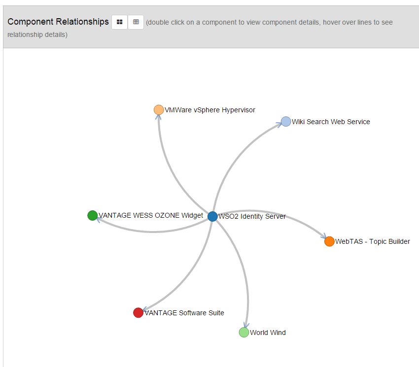
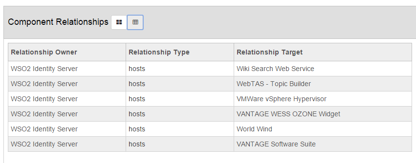

User Guide

Version 1.4
                                                      

# 1. Overview
------

The Open Storefront application is a software cataloging system that is used to catalog components
of interest to the DI2E community. Components include Government off
the shelf (GOTS), commercial off the shelf (COTS), and Open Source
software (OSS). The component evaluations done by DI2E's Centers of
Excellence are displayed in the Storefront and give details on the
following:

-   Ownership
-   Where/How to access the software
-   Software vitals
-   Conformance
-   Links to documentation, source code and other artifacts
-   Evaluation information

**Open Storefront is developed by Space Dynamics Laboratory for DI2E and is
licensed under Apache V2.**

# 2.  User Features
------

These features that are available to users to be able to access the information in a variety of ways.

##   2.1  Searching
------

Storefront Search provides a way to find component lists and articles
matching search criteria. Several types of searches are supported. The
types of searches that can be performed are:

1.  Searching across multiple fields (component name and description,
    tags, attribute types, codes, and descriptions)

2.  Wildcard searching (\* and ?)

3.  Exact phrase searching

4.  Case insensitivity

**Note:** The type ahead on the search field only looks at the title to see if  it contains the text.  
The user can then select the suggestion by clicking on it or continue with a full text search.

### 2.1.1 Search Field Differentiation or Specificity
-------

Currently, there is no differentiation among Component Name, Component
Description, Tags, or Attributes as to the preference, specificity, or
coverage of the search. A search term or phrase is searched via a single
search box, and applied across all fields equally. Advanced search per a
specific field is not currently available.

### 2.1.2 Fuzzy Matching and Wildcards
------

Fuzzy matching is defined as the ability to perform inexact matches on
terms in the search index. For example, this could be used to find all
variations of prefixed or suffixed words and multiple spellings of a
word.

Fuzzy matching is done with the \* and the ? characters acting as
wildcards. It is also known as wildcard searching. The \* character
represents a string of letters; whereas the ? acts as a placeholder for
only a single character. The process works as shown in the queries
below:

Query: offi\* Matches office, officer, official, and so on

Query: off\*r Matches offer, officer, officiator, and so on

Query: off?r Matches offer, but not officer

### 2.1.3 Phrase Searches and Exact Searches
------

Exact searches must be enclosed by double quotes.

Search example: "create a common framework"

Wildcards are only meant to work on individual search terms, not on
phrase searches / exact searches, as demonstrated by this example:

Works: softwar\* eng?neering

Does not work: "softwar\* eng?neering"

In the second example, the search would only return results that had the
\* and ? characters exactly in their respective places instead of
accepting any character in those locations as the user intended.

### 2.1.4 Case Insensitivity
------

Searching is case **insensitive** and allows mixing of case. In the
examples below, the exact same results would be returned regardless of
the capitalization.

Search examples: "create a common framework" **OR** "Create a Common
Framework"

Search examples: create common framework **OR** cReatE CoMmoN
FraMewoRk

### 2.1.5 Noise Words
------

Avoid searching with noise words, unless they are part of a
double-quote-enclosed exact phrase search. Some common noise words
include: a, an, and, are, as, at, be, but, by, for, if, in, into, is,
it, no, not, of, on, or, such, that, the, their, then, there, these,
they, this, to, was, will, with.

Search example: create a common framework

This search works, but the 'a' will return more results than are desired
since results with the word 'a' will be returned in the search.

Search example: create common framework

This search works, and will return fewer, more specific results. It will
return *only* those places where the three words *create*, *common*,
and *framework* are found.

The only time that including noise words may be recommended is when
performing an exact search and the words are a necessary part of the
phrase being searched. For more information on exact searches, see
section 1.1.3.

## 2.2 SvcV-4
------

SvcV-4 is a DI2E architecture taxonomy. The application provides
functionality to search for listing by SvcV-4 taxonomy.

A user may use this feature to look for capabilities that are available
in the DI2E community.

**To search by SvcV-4:**

1.  Go to home page

2.  Click on SvcV-4

3.  Navigate the search tree on the left and the application will show
    the description of the taxonomy and the related search results.

**NOTE:** All child branches are searched. (Eg. 1.2 …will also show
1.2.1, 1.2.2…etc)

## 2.3 Filtering
---------

Filters are applied to a set of search results from the search results
page.

Here is a list of filters that may be applied:

Available Filters

-   *By Text*     - Filters results by the title of the listing.
-   *By Tag*      - Filters results by matching tags
-   *By Rating*   -  Filters results by User Review Rating
-   *By Attribute*  - Filters results by the listing the match the selected Attributes (Vitals).

## 2.4 Tags
------

Users can "Tag" listings so that they can be used to later find and
refine search results. User-created tags are visible to all users.
However, only the owner of the tag or an admin user may remove a tag.
Tags are used in the main Omni-search field shown at the top of the
screen and on the home page.

**To create a tag:**

1.  View Component Details by clicking on the listing title in the
    search results screen.

2.  Click on the Tag icon  to open the tag panel.

3.  Enter a new tag in the text field.

**To remove a tag:**

1.  Click the "x" on the tag in the tag panel (see create tag)

**NOTE:** Recall that you may only remove your own tags.

## 2.5 Watches
-------

A watch is set on a component to allow for a user to be notified of
changes to a component. There are two ways notifications occur in the
application and there is no limit to the amount of watches a user may
place.

1.  The watched component's changes are visually shown to the user
    anytime changes have been made since they last viewed the component.
    This is seen in the watches tab and when viewing the details of
    a component.

2.  The user may opt to have an email sent anytime there is a change. To
    opt in, see the steps listed below. The email will list the section
    of the component information as to what has changed. A user then can
    login to view the exact changes.

**To create a watch:**

1.  View Component Details by clicking on the listing title in the
    search results screen.

2.  Click on the Watch icon  to add the component
    to your watch list.

**To activate email:**

1.  Make sure your user profile contains a valid email. View your
    profile from the user menu at the top right of the screen.

2.  Open the watches use the user menu at the top of the screen. Check
    the Send Email Notification box on any of the watches.

**To remove watch:**

1.  Open the watch list from the user menu.

2.  Click on the  icon.

**NOTE:** Watches can also be removed from the component detail view of
the component being watched.

## 2.6 Reviews
-------

Reviews are user-submitted feedback on a component. A user may view
other users' reviews or write a review to share experiences with a
specific component of the interface with the rest of the community.

**To create a review:**

1.  View Component Details by clicking on the listing title in the
    search results screen.

2.  Click on the Reviews tab.

3.  Click on **Write a Review**.

4.  Fill out the form starting with marking the Stars according to
    your experience.

5.  Save the review. The review will now show in the review tab for
    other users to read.

**To edit a review:**

1.  Open the component review dialog from the user menu.

2.  Expand the desired review by clicking the expand
     icon.

3.  Click the **Edit** button and adjust the information in the form.

4.  Click **Update Review**.

**To remove a review:**

1.  Open the component review dialog from the user menu.

2.  Expand the desired review by clicking the expand
     icon.

3.  Click on the **Delete** button.

**NOTE:** A review may also be removed from the component detail screen
by then clicking on the delete icon  next to the
title of the review. You can only remove reviews you post.

## 2.7 Questions
---------

Questions or "Q&A" allow users to post questions about components and
allow other users to answer those questions based on their experience
with the component.

**To post a question:**

1.  View Component Details by clicking on the listing title in the
    search results screen.

2.  Click on the Q&A tab.

3.  Fill out the form at the bottom.

4.  Click the **Post** button.

**To edit your question:**

1.  View Component Details by clicking on the listing title in the
    search results screen.

2.  Click on the "Q&A" tab.

3.  Click on the edit icon  next to the question.

4.  Fill out the form.

5.  Click **Save**.

**To remove your question:**

1.  View Component Details by clicking on the listing title in the
    search results screen.

2.  Click on the "Q&A" tab.

3.  Click on the delete icon  next to the
    question .

**To answer a question:**

1.  Expand the question by clicking on the expand
     icon.

2.  Fill out the form.

3.  Click **Post**.

Once you have answered a question, your answer may be edited and removed
using the buttons next to the answer.

## 2.8 Comparing
---------

The comparison feature allows for side-by-side viewing of multiple
listings. For example, there may be several components that provide the
same kind of features (e.g. Cesium and Google maps). You can use the
comparison feature to view their details together to find the component
better suited your project's needs.

**To compare components:**

1.  From the Search Results Screen click **Compare All** or click the
    check on 2 or more components and then click on the
    **Compare** button.

2.  In the compare screen, click on two of the listings to display
    them side-by-side.

3.  You can customize the details being viewed by checking the items
    available in the **Sections to compare** area.

## 2.9  Printing
--------

Allows for customizable print view of a component listing that can be
used in printing or for converting to PDF using the web browser's
features.

**To view a print version of a component:**

1.  View Component Details by clicking on the listing title in the
    search results screen.

2.  Click on the Print icon  to bring up the
    print window.

In the print window, you can customize what is printed by selecting
**Custom Template**. Once what you view in the print window is ready,
click the Print icon  to bring up the browser
print dialog and complete printing.

## 2.10 User Profile
------------

All user information can be set in the profile. Initially the user
profile is populated with information from the user's external security
account.

**To edit your profile:**

1.  Select **User Profile** from the user menu.

2.  Click on the **Update User Info** checkbox.

3.  Update the form.

4.  Click **Save User Profile**.

## 2.11 Changes Notification
--------------------

The application sends out notification emails about any changes that
have occurred since the last time a recent change notification email was
sent out. This allows the user to be aware of all the new and modified
listings on the application.

**To receive the notification:**

1.  Select **User Profile** from the user menu.

2.  Click on the **Update User Info** checkbox.

3.  Enter in a valid email address.

4.  Check the **Notification** checkbox.

5.  Click **Save User Profile**.

# 3.  Application Administration  *
----------

Admin tools allow for the management of all data in the system.
 
(Sections marked with a * requires admin account access)

## 3.1  Users *
------

Every user in the system has a user profile.  A user profile contains information
about the user and their user specific settings.   The initial creation of the profile
at first login will contain the information gathered from the external security application.

### 3.1.1 Creation *
------

The application doesn't directly manage user-only profiles. When a user
first securely logs in, a profile is created. It's up to the applicable
security utility (Open AM, LDAP, Database…etc.) to define the users.

### 3.1.2 Messaging *
------

Users can message other users using User Profiles. The message will be
emailed to the email address listed in their profile.

**To message a user or a group of users:**

1.  Navigate to the User Profiles Tool.

2.  Click on the message icon  next to the user
    (or users) that you want to message.

3.  Fill out the form.

4.  Click **Send** to send the message immediately.

**NOTE:** Messages are sent to email addresses one at a time so no email
addresses are leaked to other users.

### 3.1.3 Control *
------

An admin may edit, activate or inactivate a profile. Inactivating a
profile does not prevent login. Upon login, the user's profile will be
reactivated. Once a profile has been inactivated, that user's watches
and messages are also inactivated. Reactivating the profile will
activate the user's existing watches, but it won't send any previous
messages – just messages going forward.

**To toggle active status:**

1.  Navigate to User Profiles Tool.

2.  Click on the activate/inactivate  icon and use
    the filter option to view active/inactive users.

## 3.2 Components *
----------

### 3.2.1 Managing *
----------

Components can be managed using the Components Tool.  Components are created by an application administrator.

**To create a component:**

1.  Click on the **Add** button in the toolbar.

2.  In the Add/Edit dialog, fill in the form.

3.  Click **Save**.

**NOTE:** Setting a component's Approval State to **Approved** will make
the component immediately searchable. It's recommended to initially set
the component to **Pending** until all data is entered.

1.  After saving, several tabs are available which allows for entering
    Additional information such as Attributes, Contacts, and
    Resources, etc. Each tab has independent forms allowing for
    fine-grain editing which is important for the watches feature.

**To edit component:**

1.  Click on the edit icon  in the action column
    on the component you wish to edit.

2.  Make changes by filling out the appropriate form.

**To preview component:**

1.  Click on the preview  icon in the action
    column on the component you wish to view. A new tab in browser will
    open and display the component detail page.

**To toggle active status:**

1.  Click on the activate/inactivate  icon in the
    action column on the component you wish to edit.

**NOTE:** Use Filter Options to show active/inactive components.
Inactive components are not visible to or searchable by users.

**To remove a component:**

**WARNING:** This is a hard delete and it will remove all associated data
(media, user reviews, questions, etc.)

1.  Click the delete icon  to remove.

2.  Confirm that you want to delete the component by clicking **OK** on
    the confirmation dialog.

**To export a component:**

1.  Select the component(s) you want exported.

2.  Click the **Export** button in the toolbar.

 Components are exported as zip files containing a json array of the
 component data, media and local resources associated with the selected
 components.

**To import a component:**

1.  Select a file (zip or json text file).

2.  Select import options (i.e. the user data you want to import).

3.  Click **Upload**. The processing will happen in the background and a
    new task will be created to handle the import. The application will
    notify the admin when the task is complete or if there was an issue.

### 3.2.2 Approval *
------

Approved components are searchable by all users. Pending/Not submitted
components are viewable only by an admin. The approval date is
considered to be the Recently Added date for the Recently Added list on
the home page.

**To approve component:**

1.  Navigate to the Component Tool.

2.  Click on the Edit icon  on the component
    to approve.

3.  Select **Approved** in the approval status dropdown.

4.  Click **Save**.

**NOTE:** An admin can mark a component as **Pending** by following the
step above and selecting **Pending**. Marking the component as
**Pending** makes it unapproved.

### 3.2.3 General *
------

General information about the component is found here such as the Name, 
Description, Organization, etc.

**To edit General fields:**

1.  Navigate to the Component Tool.

2.  Click on the **Edit** icon  on the component.

3.  Click the **General** tab.

**Other Fields**  
a. Approval State:  Pending | Approved | Not Submitted  
b. Component Type:  ARTICLE *(allows for watches to be put on the article)* | Component  
c. Security Type:   *select the security level of the component or article*
  

### 3.2.4 Relationships *
------

Relationships between components can be added as a Relationship Type to 
a Relationship Target with a Security Type as well.  
 
**To add a relationship:**

1.  Navigate to the Component Tool.

2.  Click on the **Edit** icon  on the component.

3.  Click the **Relationship** tab.

4.  Fill in the form and press the Add button.  You will see the new relationship below.  

**NOTE:** To view the graphical representation of relationships, go to
the *DETAILS* tab of that component (in the search results) and scroll
to the bottom to the Component Relationships section.  The relationship
can be viewed either in either a graphic or table form.

  

### 3.2.5 Resources *
------

Resources are links to documentation, the home page, sources, etc. that
are related to the component. Resources are typically external, however,
they can be hosted locally.

**To add a resource:**

1.  Navigate to the Component Tool.

2.  Click on the **Edit** icon  on the component.

3.  Click the **Resources** tab.

4.  Fill in the form and upload a file or enter in an external link, but
    not both.

**NOTE:** You can edit, activate/inactive, or delete a resource.
Inactivating makes it not visible to the users. However, the resource is
still there so it can be reactivated.

### 3.2.6 Media *
------

Media provides visual/audio descriptions of the component. A common
example is a screenshot. Media is typically hosted locally and
previewers for common types are available. However, media can also be
hosted externally.

**To add media:**

1.  Navigate to the Component Tool.

2.  Click on the **Edit** icon  on the component.

3.  Click the **Media** tab.

4.  Fill in the form and either upload a file or enter in an external
    link, but not both.

**NOTE:** You can edit, activate/inactive, or delete. Inactivating make
it not visible to the users. However, the media is still there so it can
be reactivated.

### 3.2.7 Evaluation *
------

Components may be evaluated and, if so, that evaluation information may
be captured on the component so that it can be displayed to the user.
Right now, only evaluation sections can have a score associated with
them.

**To add/update evaluation scores to a component:**

1.  Navigate to the Component Tool.

2.  Click on the **Edit** icon  on the component.

3.  Click the Evaluation Information tab.

4.  Enter in the scores or mark **Not Applicable**.

**NOTE:** A section can have no value which allows for controlling which
evaluation section shows for a component. For example, if a new section
is added, existing components would show their existing evaluation
sections until a value is entered. The existing column shows the value
that is currently saved, if any. To remove the value click the delete
 icon.

## 3.3  Attributes *
----------

Attributes are used to group and filter catalog items and articles.

### 3.3.1 Types *
------

Attribute Types represent a related group of specific categories or
represent a single attribute of a listing (Eg. "Funded" would be a type
with the corresponding value "Yes" or "No"). A type may have many codes.  

Deleting a type will delete the associated codes and component
attributes. Inactivating a type will inactivate associated data such as
component attributes.

**NOTE**: Avoid "/" and special characters in type codes. For example,
use: \[A-Z\]\[0-9\].

**To add or edit a type:**

1.  From the Attribute Tool, click on the **Add** or the
    **Edit** button.

2.  Fill in the form.

**NOTE:** The Attribute Type Code field should be all caps and should not
contain spaces or "/".

3.  Save the form and you can proceed to editing the codes for the type.

**To export a type:**

1.  Select which types to export.

2.  Click **Export**.

Exports are in JSON format and contain the type and all related codes.

**To import a type:**

1.  Use the Attribute File Import.

2.  Click **Import**.

3.  Select an Attribute File. This should be a JSON attribute file.

4.  Click **Upload**.

 The Import will be processed in the background. The task notification
 area next to the user menu will indicate when the import task has
 completed.

 The processing behavior is: for every code not in the import, the
 existing code will be inactivated. If the code already exists and
 doesn't match, then it will be updated. For code that matches, the
 code in the file will not be processed. If a type doesn't exist, a new
 one will be created. If the type matches, it will be updated. Other
 existing types not found in the file will not be affected.

**Importing SvcV-4:**

1.  Use SvcV-4 import.

2.  Make sure the SvcV-4 file is in the correct format (CVS) and it
    contains the correct columns. (See warning on upload for the
    expected fields)

3.  Select a SvcV-4 import file.

4.  Click **Upload**.

 **WARNING:** UID in the file should match what is stored in application.
    The application support both 1 and 0001 matching to 1.

Processing behavior works the same as the Attribute import process.

### 3.3.2 Codes *
------

An attribute code is a specific category value that can be applied to a
component. For example: Component listing may contain and attribute for
"Funded" as "Yes".

**To add and edit a code:**

1.  Select which Type to edit.

2.  Select **Manage Codes**.

3.  Click **Add New Code** or the  edit icon.

4.  Fill out the form.

5.  Click **Save**.

Field  Descriptions:

-  **Label**              - Human readable value of the code
-  **Code**                - System reference key
-  **Description**       - This is a detail description of the meaning of the value. It's used in popup to help users interpolate the data.
-  **Group Code**        - Using to create sub groups in the code. Typically used only in special cases.
-  **Sort Order**          - Use to force a specific sort order. (Default is sort by Label)
-  **Architecture Code**   - Used for special hieratical sorting. Only applies to Architecture attribute types.
-  **Badge URL**           - Set to add a graphical badge for a code
-  **Highlight Class**     - Used to add color emphasis to a code.

### 3.3.3 Badges *
------

Allow associating an image with a specific code value. Badges show up on
listings and can be used as visual indication that a component meets a
specific criteria. Badges are referenced using a URL that URL can be
internal (setup by using the Media Tool) or external which allows for
dynamic badges. Internal Media is referred to by name so that switching
images can be accomplished with having to manually update all links.

**To add a badge to an attribute code:**

1.  Navigate to the Media Tool.

2.  Click **Add**.

3.  Fill out the form and upload image. (Note that SVG may need to be
    adjusted to be used by IE. Typically, this involves adjusting the
    viewport attributes so the image scales properly.)

4.  Select and copy the Resource URL.

5.  Navigate to the Attributes Tool.

6.  Edit Type and then edit the Code to which the badge applies.

7.  Paste the URL into the Badge URL field.

8.  Click **Save**.

**To add a badge to a component:**

1.  Navigate to the Component Tool.

2.  Click on the **Edit** icon  on the component.

3.  Select **Attributes** tab.

4.  Add the attribute by selecting the type and code with the badge.

### 3.3.4 Highlighting *
------

Highlighting allows specific code to be visually highlighted in the
application. If a particular value is determined to be desirable, it may
be highlighted in green, or if a value represents something the user
should be cautioned about then it may be red. Highlighting allows an
admin to apply that behavior to a value.

**To apply Highlighting to an attribute:**

1.  Navigate to the Attributes Tool.

2.  Edit Type and then edit the Code to which the highlighting should
    be applied.

3.  Select desired highlight color from the dropdown.

4.  Click **Save**.

## 3.4  Articles *
--------

Articles (topic landing pages) can provide information about a specific category 
or set of components.   Articles are created by an application administrator.

### 3.4.1 Managing *
------

Articles are tied to specific categories (Attribute Type and Code). This
allows for filtering and association with components. Articles are only
visible when the Attribute Code associated with the article is active.
Any attribute code may have an article associated with it.

**To create an article:**

1.  Click **Create Article** from the Article Tool.

2.  Select the Type and Code with which the article should
    be associated.

3.  Enter a Title for the article. This will be shown as the title in
    the search results.

4.  Enter a short description of the article to be displayed in the
    search results.

5.  Enter the Article using the rich text editor.

6.  Click **Save** when ready to publish the article. It will be
    immediately viewable by users. Use **Preview** to view changes
    before saving.

**NOTE:** Clicking **Export** will export selected articles to a JSON
file which can be imported using the Import Tool. On import, the matched
Type and Code articles will update existing and non-matched will create
new articles. Any internal images in the articles will need to be
manually set up using the Media Tool in-order for them to be displayed.

### 3.4.2 Media *
------

Adding media (specific images) to an article can be accomplished by
first adding the media using the Media Tool. The URL can then be copied
and used in an article by using the Rich Text Edit Tools.

### 3.4.3 Component Lists *
------

The contents of an article may be mostly HTML tags (the Edit Tool
defines the available formatting options). It may also contain a special
widget that shows a list of components matching an admin-defined set of
criteria. Beware of copying and pasting values into the component list
configuration form. It can introduce errors that are hidden in the form
and are only visible by using the **Source** button of the editor. Only
**Title**, **Type** and **Code** need to be set; the other options are
for advanced cases only.

## 3.5 Watches *
-------

The user can create watches that can send notifications to the user. The
messages that the watches generate are viewable from the User Message
Tool. The User Message Tool allows for queued messages to be processed
after a delayed time period. The queue delay allows for messages to be
pooled by type thereby reducing the amount of emails rapid changes can
create. The User Message can also be used to view previously sent
messages in cases of troubleshooting whether the system sent a
notification or not. The tools also allow for manually processing the
queue immediately, but in most cases this is not needed or desired as
the automatic process will take handling the message queue.

Watches can be placed on Components or Articles by selecting either in
the drop-down "Component Type" in the General tab when editing or adding
a component.

**NOTE:** Other user messages besides watches, such as alerts, flow
through the message queue as well.

## 3.6 Integrations (External Systems/Jira) *
------------------------------------

Component Integration allows for pulling information from an external
system and mapping that back to a component in the application. This
allows for automatic sync of the data source. Currently the application
only supports integration with Jira.

**To setup a Jira Integration:**

1.  Navigate to Integration Management Admin Tool using the admin
    navigation menu.

**Add Mappings:**

1.  Select Jira Project.
2.  Select Issue Type.
3.  Select Attribute in application.
4.  Select Jira field to which to map.
5.  Create mapping by moving them from the available list to
        attribute codes.
6.  Click **Save**.

 **NOTE:** More than one field in JIRA can be mapped to an attribute
        code.

**Add Configuration:**

1.  Create a new Configuration by clicking **Add** on the Component
    Configuration tab.
2.  Select a Component.
3.  Click **Add**
4.  Select JIRA Project (only projects with mappings will be available).
5.  Enter the Jira Issue Number (Eg. ASSET-14)
6.  Click **Save**.

The Component Job will be scheduled when it's saved. The job will run on
an interval based on the global refresh rate. The default is once a day
at 10:00 am server time. The component configuration table will show
when the integration last ran. Also, the scheduled integration job can
be viewed using the Jobs Tool by clicking **Show Integration Jobs**.

The Integration Tool allows for manual control. However, it's not
necessary to run the integration manually as the automated job will
handle that.

If the integration fails for any reason, the configuration table will so
indicate and an error ticket will be created for further analysis. The
integration may fail if the server it's connecting to is unavailable.
This may be a temporary condition. The system will try again on the next
interval. If the configuration job continues to have issues it may
deactivated manually using the tools and then reactivated when the issue
is resolved.

## 3.7 Alerts *
------

Alerts are triggers set up to watch the data that an administrator can
subscribe to. This allows for "reactive" administration of the
application by setting up alerts when events occur in the system. The
application will monitor the data as it flows in and trigger alerts that
have been setup.

Descriptions of Alert Triggers:

-  **Component Submission** - Alerts on component submissions and cancellations.
-  **System Error**         - Alerts on system error according to trigger options.
-  **User Data**            - Alerts on user data changes according to trigger options.

**To set up an Alert:**

1.  Navigate to the Alerts Tool.

2.  Click **Add**.

3.  Fill in the form and select an Alert Type.

4.  Select any appropriate report options.

5.  Click **Save**.

**To cancel an Alert:**

1.  Navigate to the Alerts Tool.

2.  Click **Inactivate**  or **Delete**
     to cancel the scheduled report. Click
    **Inactivate** to temporarily pause it.

## 3.8 Reports * 
--------

Descriptions of the Reports:

-  **Component**        - Reports on a component's statistics
-  **Link Validation** - Checks all component links and verifies the status of the links to determine potentially bad links.
-  **Organization**   -  Reports on organization's statistics based on information in user profiles. The report attempts to group users by an organization.
-  **Usage**            -  Reports on the application's usage statistics for a specified time period.
-  **User**             - Reports on user statistics (views, logins, etc.)

A report can be either manually generated on demand or set to
auto-generate according to a specific schedule.

### 3.8.1 Manually Generated Reports *
------

**To manually generate a report:**

1.  Navigate to the Report Tool.

2.  Click **New Report**.

3.  Select Report Type and Format.

4.  Set any options.

5.  Click **Generate**.

The Report is generated in the background and the status of the report
is shown in the table. Once the report is complete, it can be downloaded
by clicking the report title link.

### 3.8.2 Scheduled Reports *
------

**To create a scheduled report:**

1.  Navigate to the Report Tool.

2.  Click **New Report**.

3.  Select Report Type and Format.

4.  Set any options.

5.  Check the **Schedule** box.

6.  Set the interval to run the report and enter an email address.

7.  Click **Generate** to save the scheduled report.

**NOTE:** The report will run initially and then it will run on the next
scheduled interval.

**To cancel a scheduled report:**

1.  Navigate to the Reports Tool.

2.  Select the Scheduled tab.

3.  Click **Inactivate**  or **Delete**
     to cancel the scheduled report. Click
    **Inactivate** to temporarily pause it.

### 3.9 Event Tracking *
--------------

The application tracks internal user logins, Component/Resources views,
and Article views. The application also can be integrated with external
analytics such as google analytics for additional information. Also, the
application server can be configured for access logging and the
application logs audit message for all admin API access.

The primary tracking events can be viewed using the Tracking Admin Tool.
As well as the events are aggregated into various system generated
report accessible via the Reports Admin Tool.

## 3.10 Jobs Tool *
---------

The Jobs Tool allows for viewing and managing both scheduled background
jobs and background tasks. An Admin can use the tool to pause, start,
and run scheduled jobs. This tool helps in troubleshooting and view of
the status of the application. If an operation is known to potentially
run for an extended period of time, then it will process in the
background allowing for faster feedback to the user while the operation
completes. Scheduled jobs that run periodically such as the notification
job also run in the background to provide automatic handling of
services.

## 3.11 System Tools *
------------

System Tools are provided to aid in troubleshooting.

System Tools and their Purpose:

-  **Search Control** -           Allows for re-indexing listings
-  **Recent Changes Email** -     Allows for sending/previewing a recent change email.
-  **Error Tickets** -            View error tickets generated by the system and view their details.
-  **Application Properties** -   Can be used to adjust application run state.
-  **System Configuration** -     Provides a read-only view in the current properties.
-  **Logging** -                  Allows for adjusting log levels at run time to log more/less information from a software component. **NOTE:** Logs are hierarchically organized so set a level from a parent will affect all children who are set to delegate to the parent logger. Loggers under: edu.usu.sdl.openstorefront are application specific. A logger will only appear when the software component is loaded.
-  **Status** -                   Shows the run status of the application (i.e. memory, load, thread status and properties). Refer to Java platform documentation for the interpretation of the information.

## 3.12 Organizations *
---------------

 Organizations provide information on specific organizations that are linked with the components listed on the site. The information these objects contain include:

 - **Description** -            What the organization does
 - **Type** -                   The type of organization (i.e. Commercial Business, Contractor, US Organization, etc.)
 - **Website** -                The website for the specific organization if provided
 - **Address** -                The address for the organization
 - **Contact Information** -    A way to contact the organization

### 3.12.1 Managing
--------------

**To add a new organization:**

1.  Click **Add New Organization** from the Organizations section of the Admin Tools.

2.  Enter the information and click **Save Changes**.

**Note:** When a new component is added if an unrecognized organization is added, it will automatically be saved to the 
  organization list.  However, details such as the Description and Main Contact Information will need to be added here.

**To edit an organization**
1.  From Organizations in the Admin Tools, select an organization.

2.  Click on the edit icon  next to the organization.

    a.  Update Organization information as desired including:  Name, Description, Organization Link, and Organization Type.

    b.  Update Main Contact information as desired including:  Contact Name, Phone Number, Email, Agency, Department, 
         Address, and Security Type.
    
3.  When finished, click **Save Changes**.

**To remove an organization:**
1.  From Organizations in the Admin Tools, select an organization.

2.  Click on the delete icon  next to the organization.

3.  Confirm that you wish to delete the organization by cliking **OK**.

**"No Organization" References:**
This displays a list of references where no organization is listed.  

**Run Extract:**
This runs a query to get current component and organization information to update the table.  

# 4.  Glossary
----------

Contains definitions of term using in the application and in the help.  (See the sub-sections.) 

##  4.1  User Terminology
----------------

-  **Article (Topic Landing Page)** -   An article is a central information page that contains information on a specific topic relating to an attribute.
-  **Attribute (Vital)** -             An attribute is a specific category that has been applied to a listing. A listing (component) may have many attributes associated with it.
-  **Component (Listing)** -            A listing in the catalog. A component has the attributes that classify the information being represented by the listing
-  **Highlight** -                      A news item shown on the home page.
-  **Watch** -                          A way to track changes on a listing.

## 4.2 Admin Terminology *
-----------------

-  **Attribute Type** -       A related group of specific categories representing a single attribute of a listing (Eg. "Funded would be a type with the corresponding value "Yes or "No").
-  **Attribute Code** -       A specific value for a type.
-  **Job** -                  A scheduled unit of work.
-  **Task** -                 Background process; used for long-running operations.
-  **Component Metadata** -   Non-filterable Component Vitals. It allows for an admin to put in non-restricted key/value pairs which get added to the vitals.
